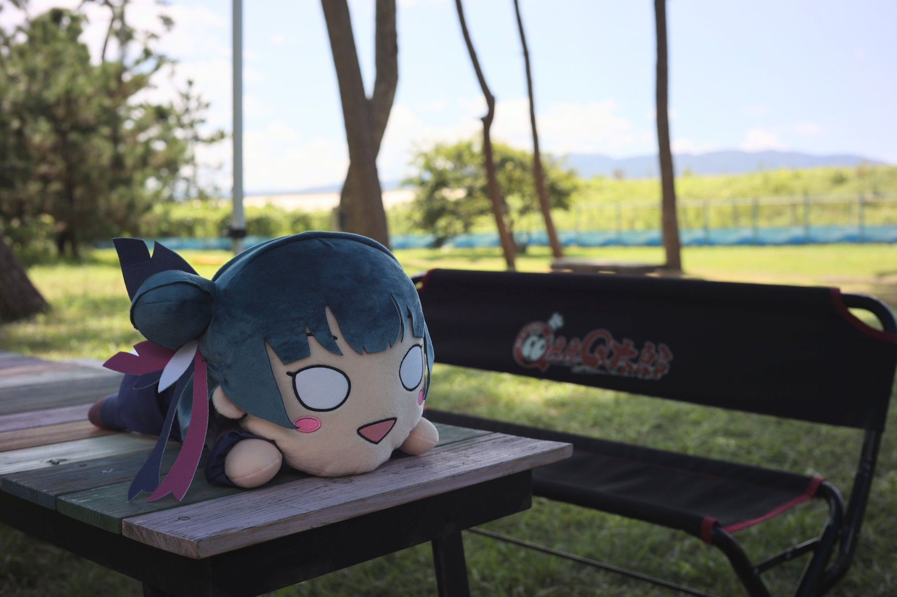
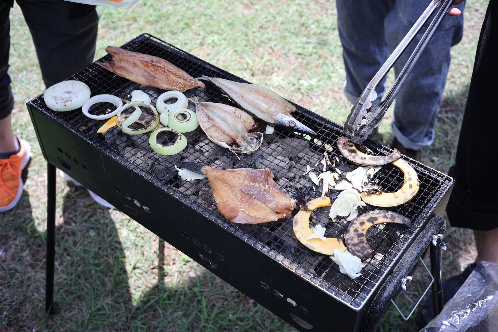

2023年8月27日に、沼津御用邸記念公園を会場として、「うみねこ会」の第2回を開催しました。 

「うみねこ会」は、うみねこのメンバー同士の交流を目的として開催しているリアル交流イベントです。

2回目となる今回は、幻日のヨハネ 第7話 「女子会ってなぁに？」の舞台のモデルとなった沼津御用邸記念公園。食材の調達や炭などの準備を施設側で行っていただける「御用邸 de BBQ」を利用し、御用邸の敷地内に用意されたスペースで、食材を焼いたり、お酒や飲み物を飲んだりしながら、交流を楽しみました。

