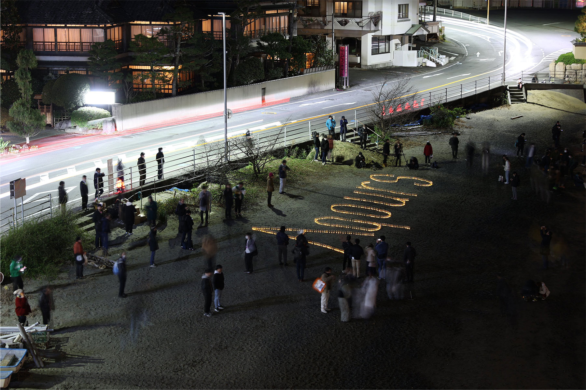
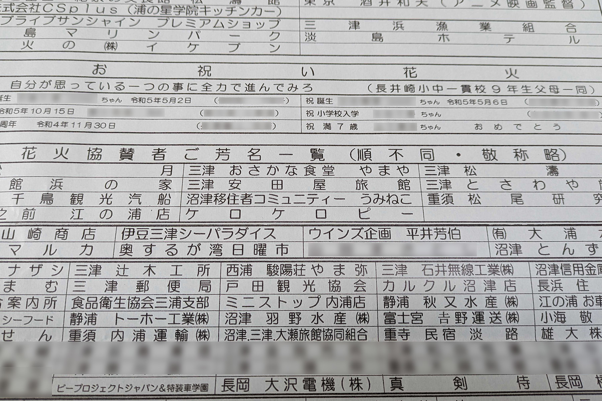

[先日お伝えしていた通り](../20231126/okusuruga_fireworks.html) 、2023年12月23日に沼津の内浦地区で開催された「奥駿河湾海上花火大会」に、沼津移住者コミュニティ うみねこより協賛させていただきました。

当日は同日開催された三津浜のキャンドルナイトや、地元の方々を始めとする出店が並んでおり、終始にぎやかな様子でした。また冬の内浦漁港で約1年半ぶりに打ち上げられた大輪の花火によってフィナーレを迎え、大変すばらしい大会となりました。

改めて、今回の協賛のためにご協力いただいた関係者の皆様には、この場でお礼申し上げます。ありがとうございました。

今回のうみねこ協賛にご協力いただいた方の一覧については、[企画発表時の記事](../20231126/okusuruga_fireworks.html)をご覧ください。
