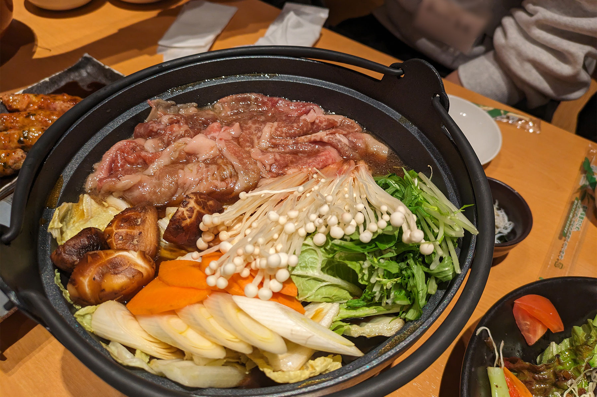
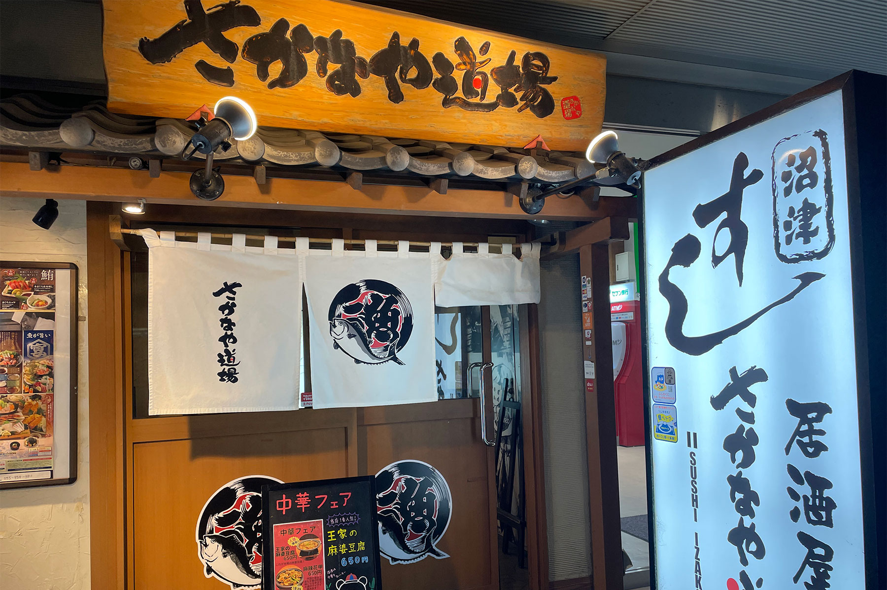
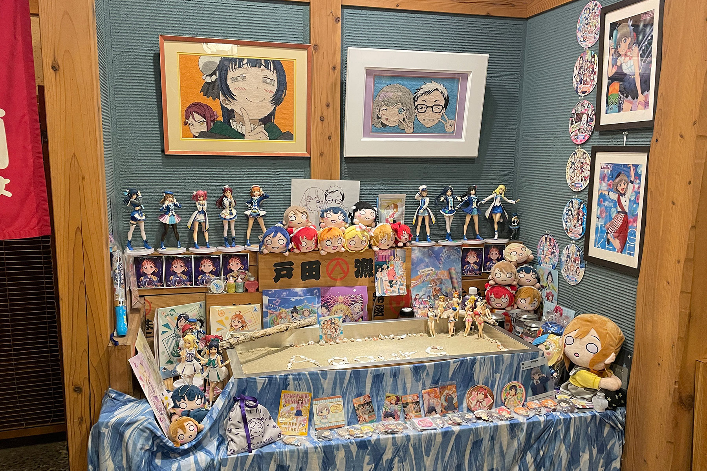
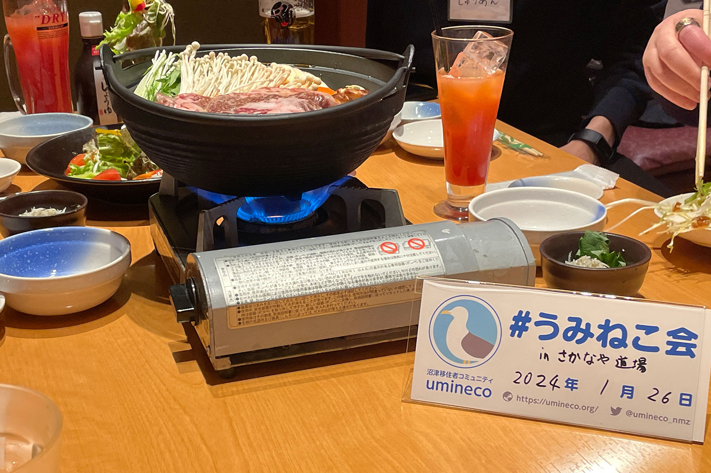
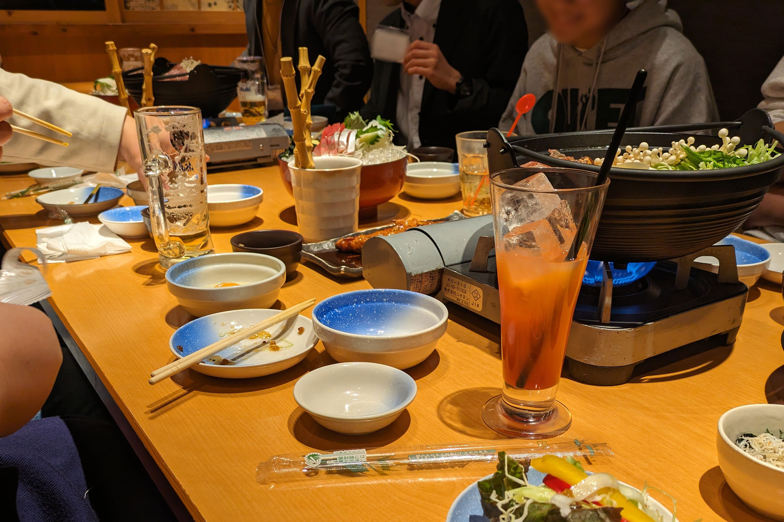

2024年1月26日に、うみねこリアル交流イベント「うみねこ会」の第7回を開催しました。

「うみねこ会」は、うみねこのメンバー同士の交流や情報交換を目的として、月に1回程度実施しているリアルイベントです。

7回目となる今回は、うみねこから15名の参加者と、[沼住クエスト](https://numajyu.com/)を主催されている関係者などを含む外部ゲストも3名ほど迎え、過去最大の総勢18人で開催しました。

「さかなや道場 沼津南口店」さんにて、うみねこ会に初めて参加するメンバーの自己紹介から始まり、移住に関する話題や、これからの沼津についての話など、各々交流を楽しみました。

