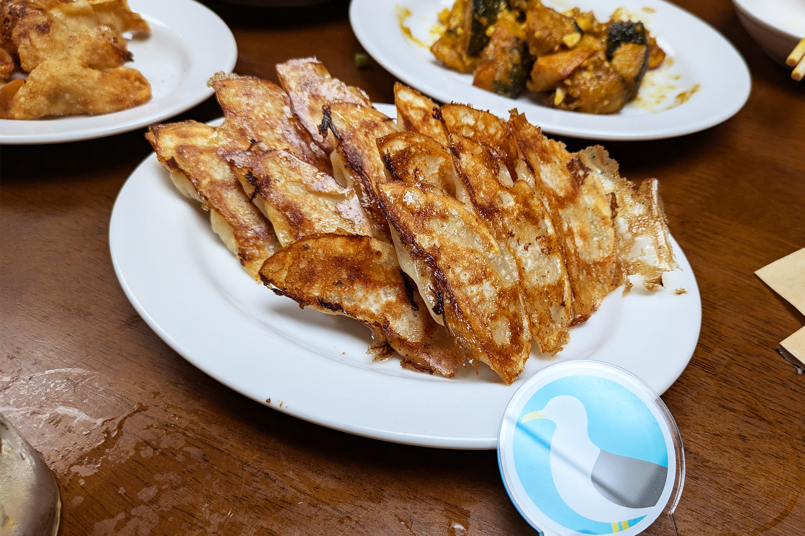
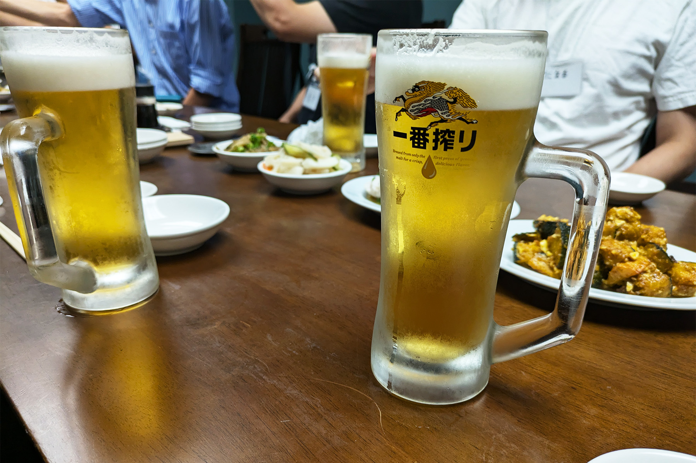
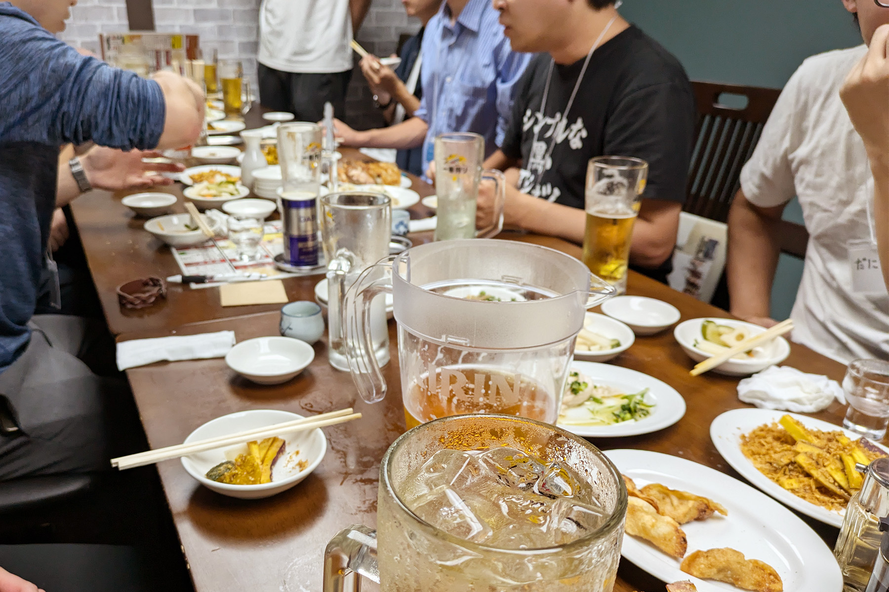

2024年10月12日に、うみねこリアル交流イベント「うみねこ会」の第13回を開催しました。

「うみねこ会」は、うみねこのメンバー同士の交流や情報交換を目的として、月に1回程度実施しているリアルイベントです。

13回目となる今回は、「301餃子 沼津駅南口店」さんにて開催し、初参加の方4名を含む、総勢12名で開催しました。

301餃子さんはこれまでもうみねこ会の会場として何度もお世話になっており、リーズナブルでありなあらも餃子を中心としたボリューム満点の料理を提供してくれるので大変おすすめです。

今回は初参加の方も多く、遠方から駆けつけてくれたメンバーもおり、それぞれの趣味や沼津移住に関する話題で盛り上がりながら、交流を楽しみました。

