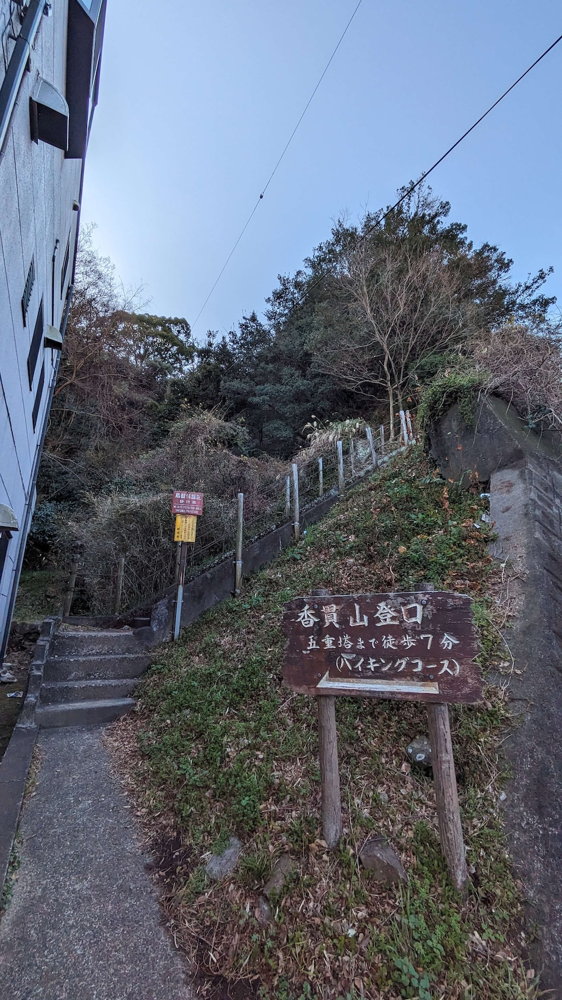
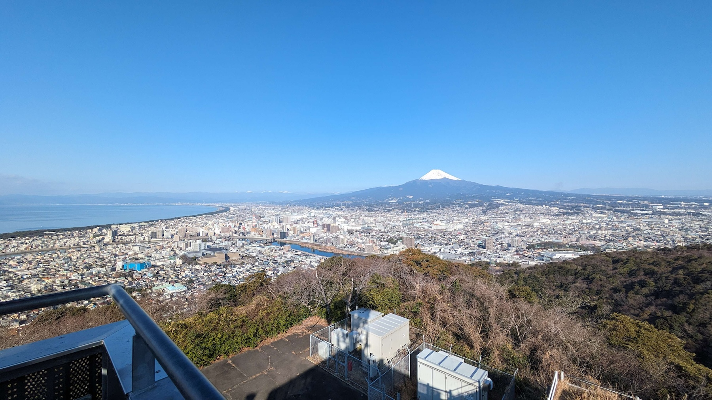
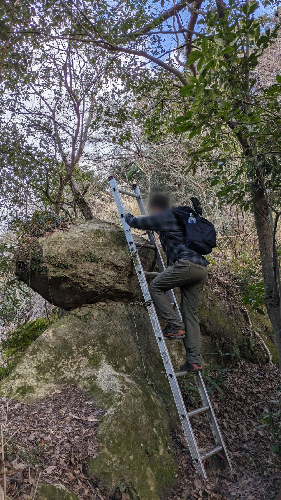
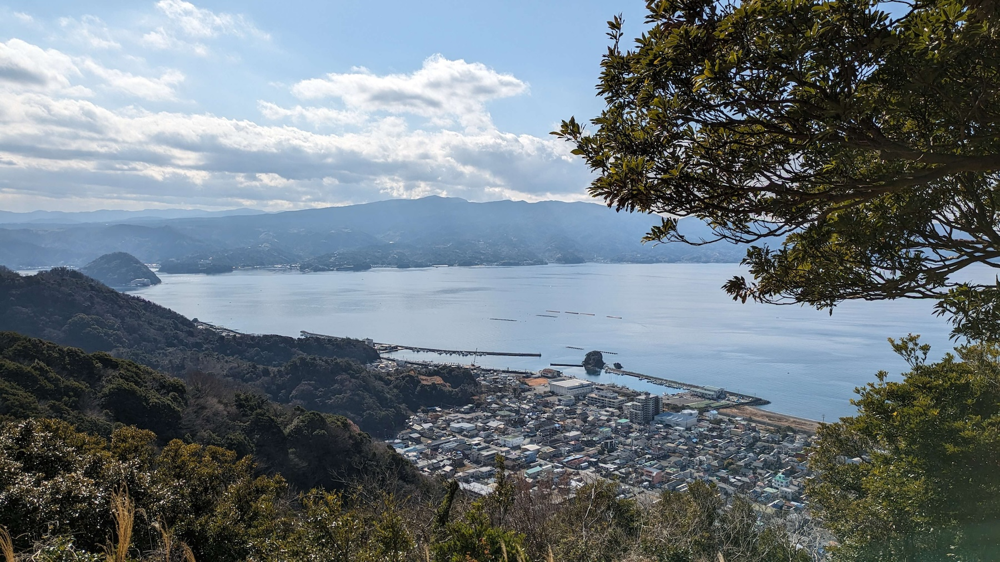

2024年2月3日に、うみねこリアル交流イベント「うみねこ沼津アルプス登山」を開催しました。

このイベントは「沼津アルプス登山の素晴らしさを広めたい！」というメンバーと「沼津アルプス登山をしてみたい！」というメンバーが集まり開催されました。

晴天に恵まれた登山日和の中、ヘトヘトになりつつも、沼津の魅力ある景色や道中で繰り広げられた和気藹々とした会話を楽しみながら沼津アルプス登山を満喫しました。

※参加したコミュニティメンバーより

「沼津アルプス登山は初心者が挑戦しやすく、その中でも沼津アルプスならではの魅力や沼津の魅力をたっぷり味わえるのでゲキ推しです！全沼津民にぜひ体験してほしいですね！」

参考：メンバーによる登山初心者向けのブログ記事: [【初心者必見】沼津アルプス登山のススメ【コース紹介】](https://oma0417.com/numazu-alps/)

