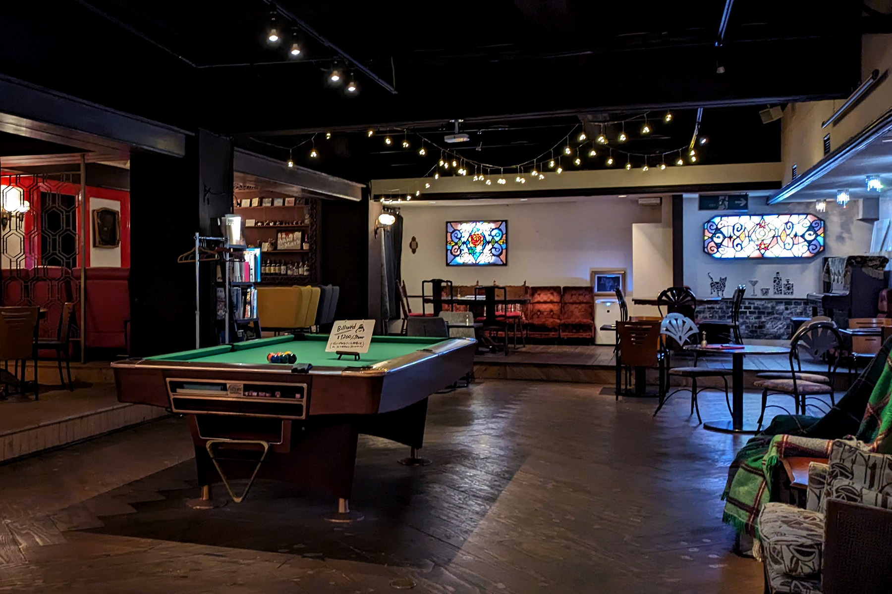

### おかげさまで「うみねこ」は1周年を迎えます

おかげさまで、来月6月9日に「沼津移住者コミュニティうみねこ」は、立ち上げから1周年を迎えます。

そこで1周年を記念し、これまでお世話になったうみねこのメンバーや沼津の皆様に感謝を伝えさせていただくため、イベントの開催が決定しました！

### うみねことは

「うみねこ」は、非法人・非営利の個人が主催する任意団体として、2023年6月9日に発足した、沼津移住者をメインターゲットとしたインターネットコミュニティです。

メンバー同士の日々の交流は、チャットツールである Discord 上で行っています。その中で、移住者同士が実際に集まりリアルな意見を交わす交流会の「うみねこ会」や、有志メンバーによる三の浦地域の花火大会への協賛を通じた地域貢献など、これまでも様々な活動を行ってきました。

* [うみねこ会 第2回 を開催しました](/news/20230827/umineco_2nd.html)
* [『沼津地元愛まつり 2023』開催のお祝いとしてフラワースタンドをお贈りしました](/news/20231007/jimoai_festival_2023_flower_stand.html)
* [『奥駿河湾海上花火大会』にうみねこが協賛します](/news/20231126/okusuruga_fireworks.html)
* [うみねこ沼津アルプス登山 を開催しました](/news/20240203/numazu_alps.html)

発足から1年でサーバーの参加者数も100名近くになり、うみねこ会もこれまでの参加者がのべ100名を超えるなど、うみねこは「移住」の先にある、地域への「定住」に必要不可欠な「繋がりの創出」を生み出すコミュニティとして、様々な企画と多くの方々のサポートを行ってきました。

今回1周年を迎えるにあたり、我々の活動に参加・協力してくださった皆様に感謝を伝える場として、記念パーティを開催させていただくことにしました。ぜひご都合よろしければ足をお運びください。また、移住を考えている方におかれましても、当日会場には多くの移住経験者が参加予定ですので、ぜひお気軽にご参加ください。

### イベント概要

<table class="table">
  <tr>
    <th>開催日</th>
    <td>2024年6月16日(日)</td>
  </tr>
  <tr>
    <th>時間</th>
    <td>
      18:00〜22:00 
      途中入退場自由ですのでご都合のよい時間にお越しください
    </td>
  </tr>
  <tr>
    <th>場所</th>
    <td>
      <a href="https://bar.nekohaku.com/">喫茶＆BAR ねこと白鳥</a> 様 
      〒410-0801 静岡県沼津市大手町5-7-5 つるかめ仲見世ビル B1
    </td>
  </tr>
  <tr>
    <th>チケット</th>
    <td>
      前売り 3,500円 / 当日 4,000円 
      ドリンクチケット2枚付き
    </td>
  </tr>
</table>

#### 当日の催しについて

今回のイベントは、沼津のバー「ねこと白鳥」様を貸し切って行うスペシャルイベントです。

当日は会場にて参加者の皆様同士での交流を楽しんでいただくことをメインとしていますが、貸し切りならではの催しとして、親睦を深めていただくためのボードゲームのプレイスペースなど、他にも様々なお楽しみも用意してお待ちしております。

#### ドリンクチケットと飲食物の持ち込みについて

ドリンクチケットは、カウンターにてビールや簡単なカクテルとソフトドリンクからのご提供になります。

食べ物や追加の飲み物につきましては、イベント運営にていくつかご用意させていただきますが、当日は会場への飲み物＆食べ物の持ち込みが自由となっておりますので、よろしければぜひみなさまのおすすめの品などをお持ち寄りいただければと思います。

### イベント参加方法

イベントの参加方法につきましては以下のとおりです。いずれにおきましても、規定人数を超えた時点で受付終了とさせていただきますので、あらかじめご了承ください。

#### うみねこのメンバーの方

うみねこの Discord サーバー にあります「#うみねこ1周年記念イベント」チャンネルの案内に従い、参加表明をお願いします。

#### 非メンバー（一般）の方

今回のイベントは、通常のうみねこ会よりオープンなイベントと位置づけており、うみねこに参加されていない方向けには以下の TwiPla から参加登録ができます。

* [沼津移住者コニュニティ うみねこ 1周年記念イベント - TwiPla](https://twipla.jp/events/618459)

イベントでは、うみねこへの加入に関する強引な勧誘等は行いませんので、安心してご参加ください。
