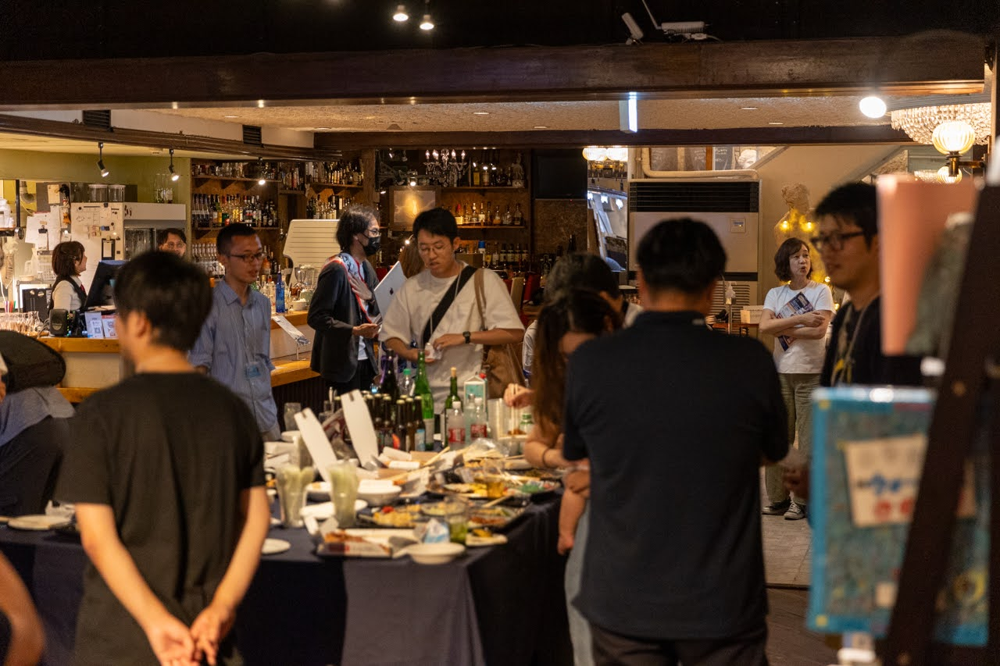
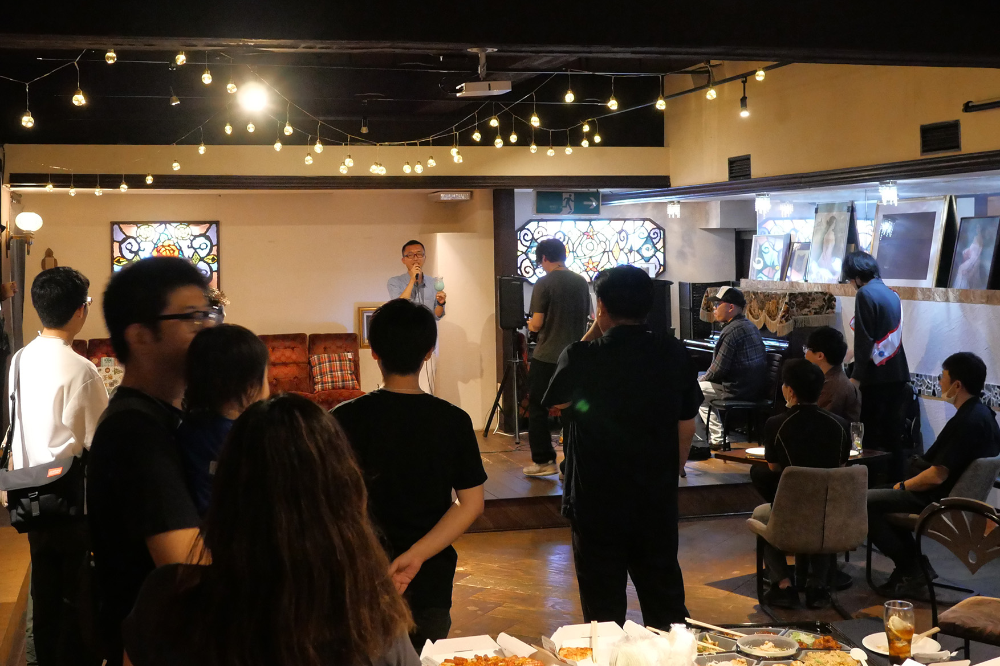
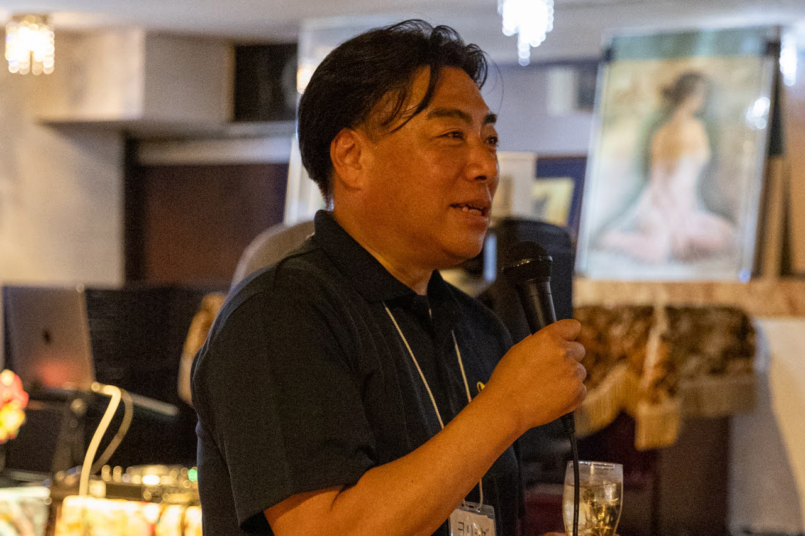
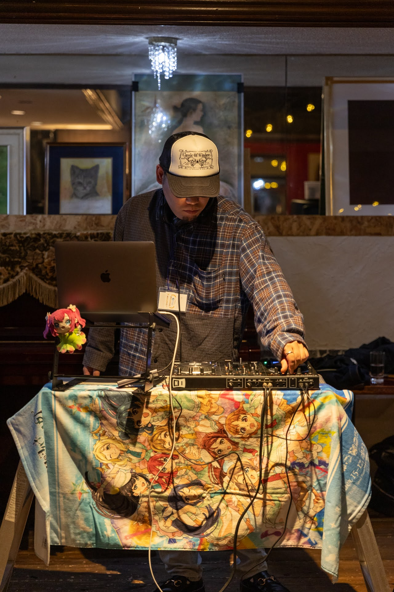
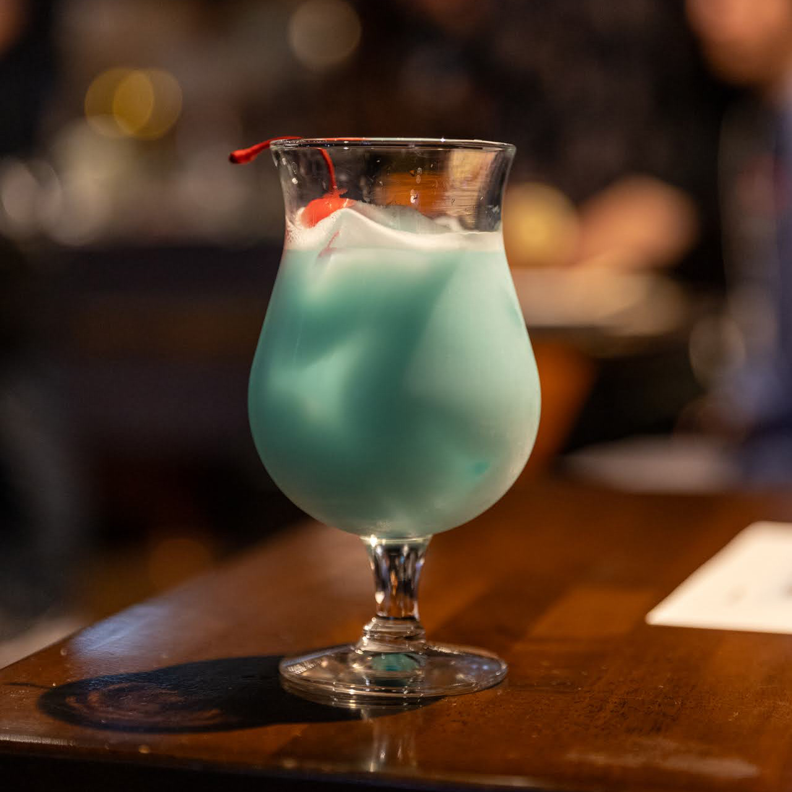
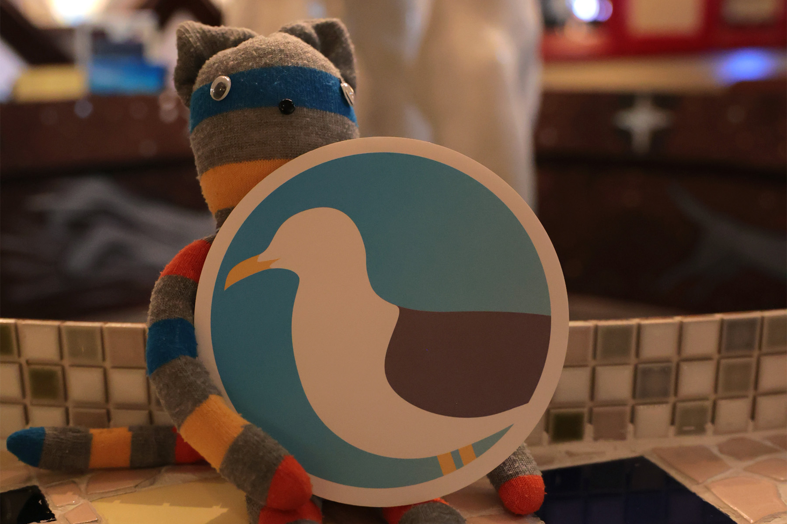

去る6月9日に迎えたうみねこ立ち上げ1周年を記念し、2024年6月16日に「うみねこ1周年記念イベント」を開催しました。

沼津のバー「ねこと白鳥」を貸し切りにして行われた今回のイベントは、うみねこのメンバーの方々に加え、これまでお世話になった方々や、一般の方々も入れるイベントとして開催しました。

イベントにはなんとスペシャルゲストとして、沼津市の市長である頼重秀一氏にもご列席いただき、うみねこ1周年のお祝いの言葉と乾杯のご発声を頂きました。

ステージ上には有志によるDJブースも用意され、参加者同士がお互いに様々な話題に花を咲かせている会場全体を、BGMでさらに盛り上げました。

さらに、ねこと白鳥様のご協力で、我々「うみねこ」をイメージしたオリジナルカクテルも会場限定で発表されました。うみねこのテーマカラーである空色を基調とし、ウミネコのくちばしの赤色をイメージしたさくらんぼを載せた、ヨーグルト風味の美味しいカクテルをご用意いただきました。

今回のイベントには、これまでのうみねこ会の最大人数を超える総勢約30名の方にご参加いただき、大変賑やかな時間を過ごすことができました。

改めて今回参加いただいた皆様、また今回のイベント開催に向けてサポートしてくださった沼津の皆様、ありがとうございました。

