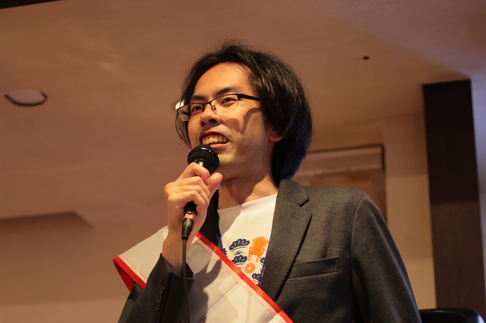
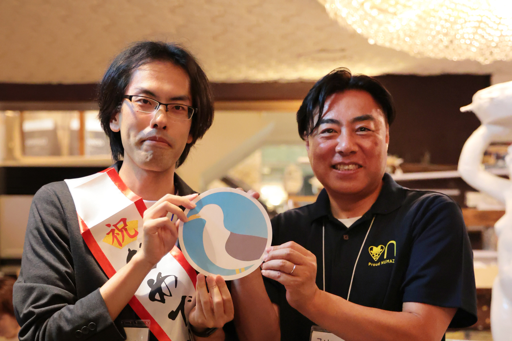

去る6月9日に迎えたうみねこ立ち上げ1周年を記念し、2024年6月16日に「うみねこ1周年記念イベント」を開催しました。

沼津のバー「[ねこと白鳥](https://bar.nekohaku.com/)」を貸し切りにして行われた今回のイベントは、うみねこのコミュニティメンバーに加え、これまでお世話になった方や、一般の方も参加できるオープンなイベントとして開催しました。

イベントの冒頭には代表の神崎から、参加者の皆様にこれまでの感謝を伝える挨拶。

そして今回のイベントにはなんとスペシャルゲストとして、沼津市の市長である頼重秀一氏にもご列席いただき、うみねこ1周年のお祝いの言葉と乾杯のご発声によってイベントがスタート。

ステージ上には有志によるDJブースも用意され、参加者同士がお互いに様々な話題に花を咲かせている会場全体を、BGMでさらに盛り上げました。

会場では、参加者同士で初対面の挨拶やお互いの自己紹介をする人も居れば、これまでの交流会で仲良くなった人同士で、共通の趣味語らうグループもあるといった様子で、ゲストの頼重市長は参加者の皆さんの話を聞いてまわられているのが印象的でした。我々のコミュニティの参加者は、沼津に移住するほど沼津が好きな人たちが多いので、それぞれが沼津に対する熱い思いを語り合う会となりました。

また、ねこと白鳥様のご協力で、我々「うみねこ」をイメージしたオリジナルカクテルも会場限定で発表されました。うみねこのテーマカラーである空色を基調とし、ウミネコのくちばしの赤色をイメージしたさくらんぼを載せた、ヨーグルト風味の美味しいカクテルで、参加者からは美味しいと好評でした。

今回のイベントは、これまで開催した「うみねこ会」の最大参加者を超える、総勢約30名の方にご参加いただき、大変賑やかな時間を過ごすことができました。

改めて今回参加いただいた皆様、また今回のイベント開催に向けてサポートしてくださった沼津の皆様、ありがとうございました。

