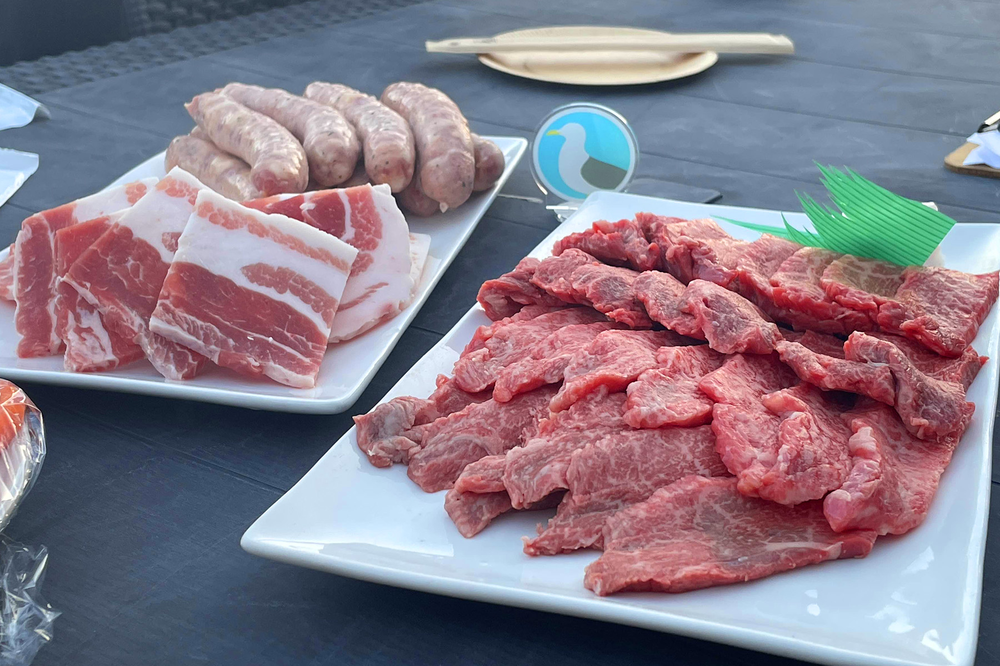
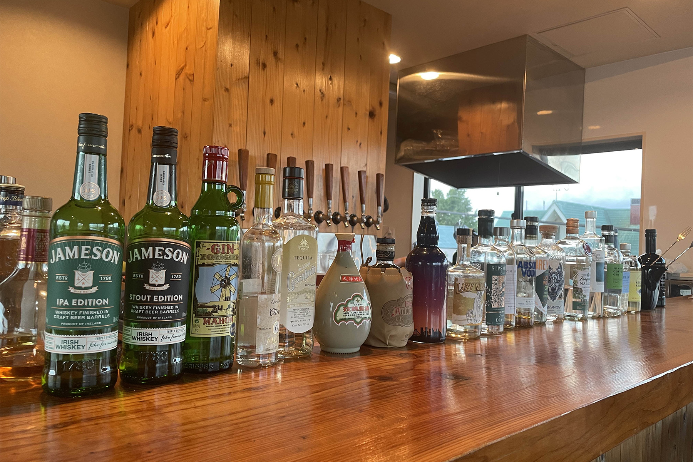
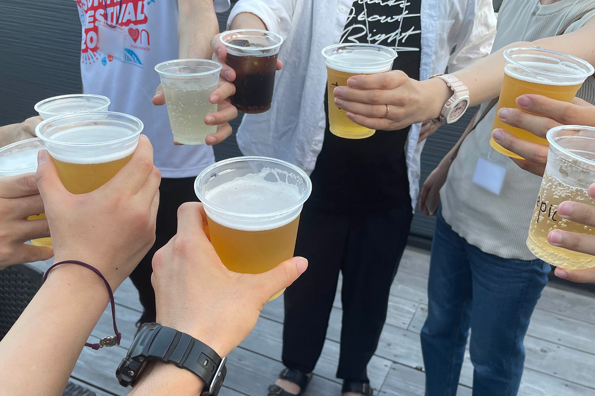
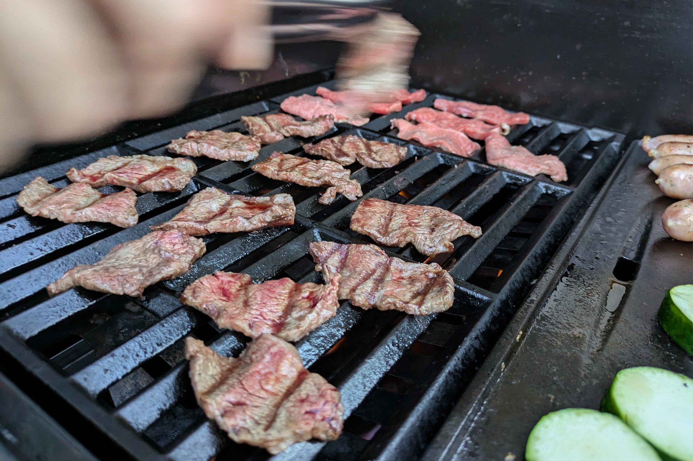
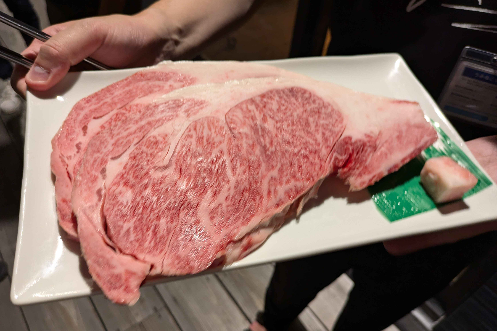

2024年8月17日に、うみねこリアル交流イベント「うみねこ会」の第11回を開催しました。

「うみねこ会」は、うみねこのメンバー同士の交流や情報交換を目的として、月に1回程度実施しているリアルイベントです。

11回目となる今回は、千本緑町に昨年末オープンした、[クラフトサワー＆クラフトビール専門店「SENSPI」さん](https://www.instagram.com/senspi_numazu/)が提供する、[BBQプラン](https://www.instagram.com/p/C9bj0TnPXYb/) を利用させていただきました。

お店側で用意していただいたお肉と、沼津クラフト・SENBON SPIRITS さんが提供しているクラフトビールやサワーが飲み放題という、お酒好きにはたまらないプランを堪能させていただきました。

