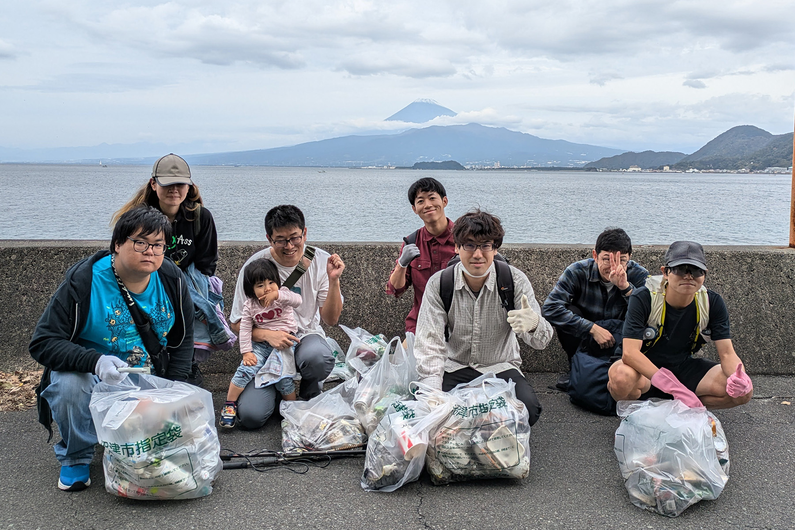
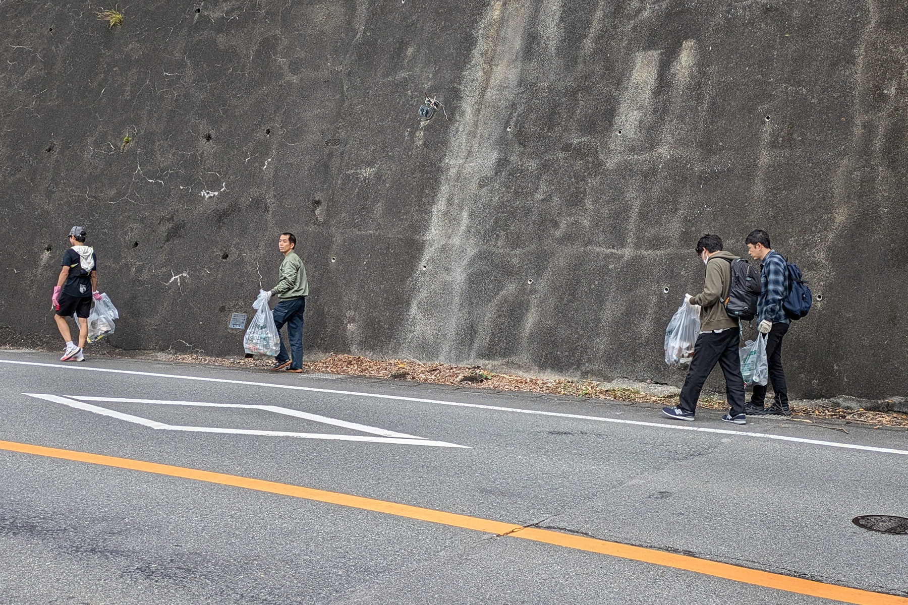
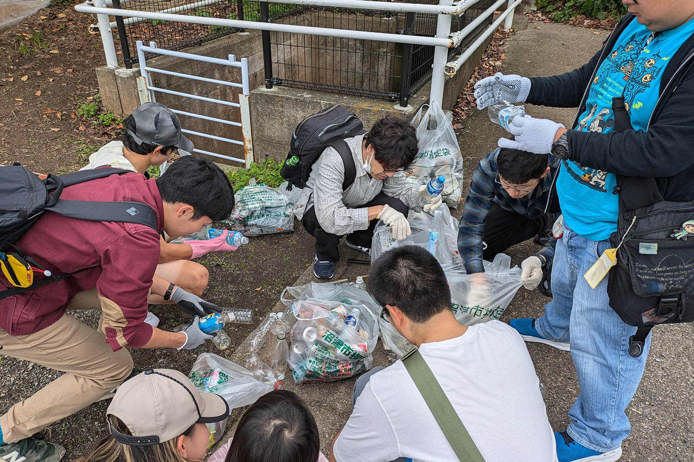

2024年11月16日に、うみねこの有志メンバーによる内浦地区（長浜〜長井崎）の路上の清掃を行いました。この活動は沼津市で行われている[市内一斉クリーン週間](https://city.numazu.shizuoka.jp/kurashi/sumai/gomi/cleanweek/index.htm)に参加したもので、移住者を中心とした団体による地域貢献の一環として実施しました。

うみねことしては初めての試みでしたが、活動中に地域の方から感謝の言葉をいただくこともあり、非常に有意義な活動とすることができました。今後も様々な形で行いたいと考えていますので、よろしくおねがいいたします。

