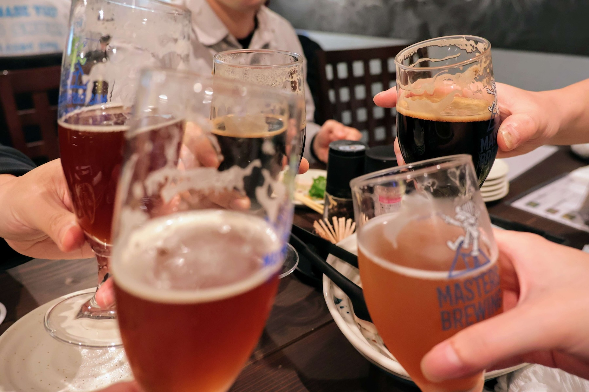
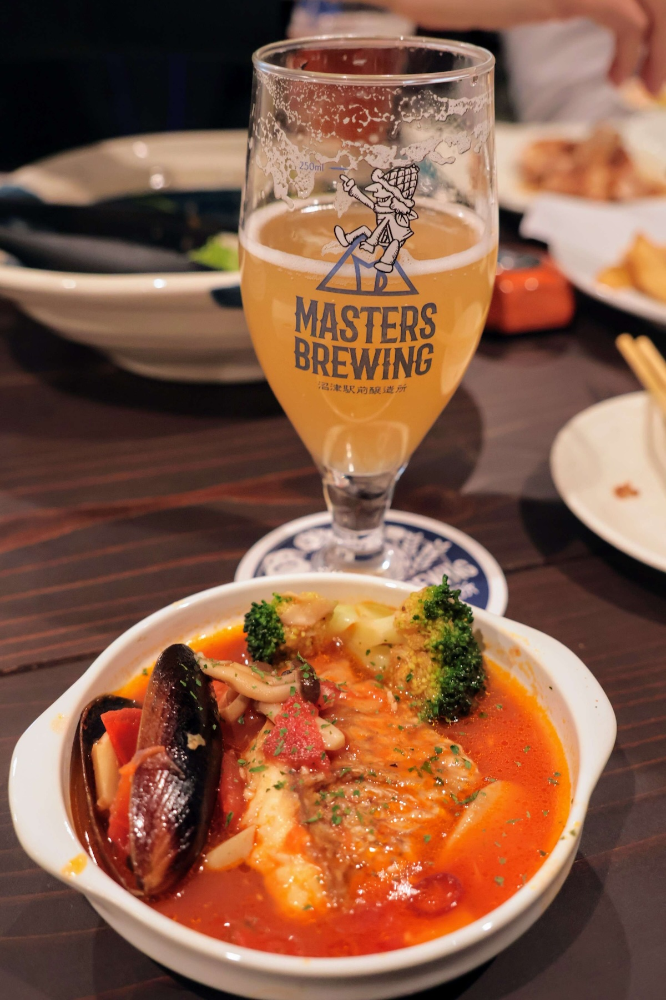
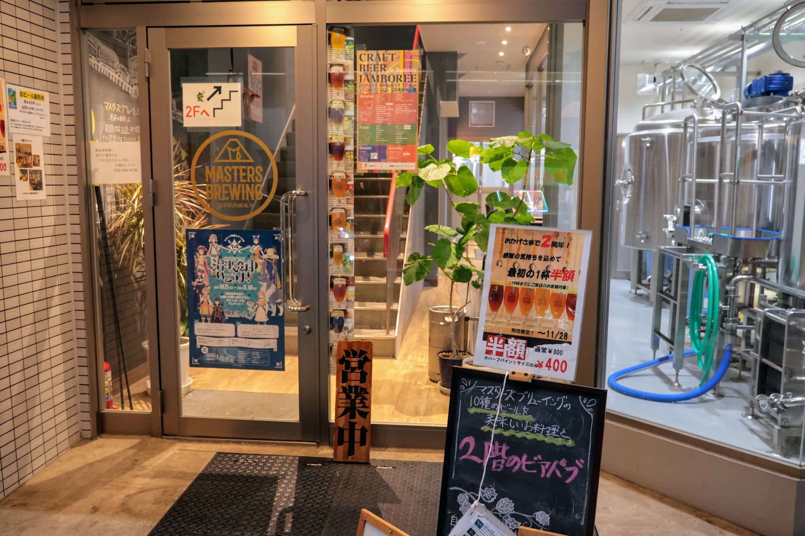

2024年11月23日に、うみねこリアル交流イベント「うみねこ会」の第14回を開催しました。

「うみねこ会」は、うみねこのメンバー同士の交流や情報交換を目的として、月に1回程度実施しているリアルイベントです。

14回目となる今回は、[MASTERS BREWING さんが営業している 2階のビアパブ](https://masters-brewing.com/beerpub/) にて開催し、総勢11名（ゲスト1名）で開催しました。

MASTERS BREWING さんは、沼津に数多くあるオリジナルブルワリーのひとつで、姉妹店で「さえ丸おじさんの店」も営業されています。

オリジナルクラフトビールが飲み放題のプランを利用させていただきましたが、ビールもコースで提供される料理も大変美味しく、様々な話題で交流を楽しみました。

