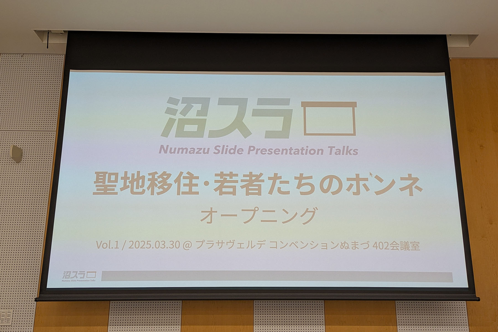
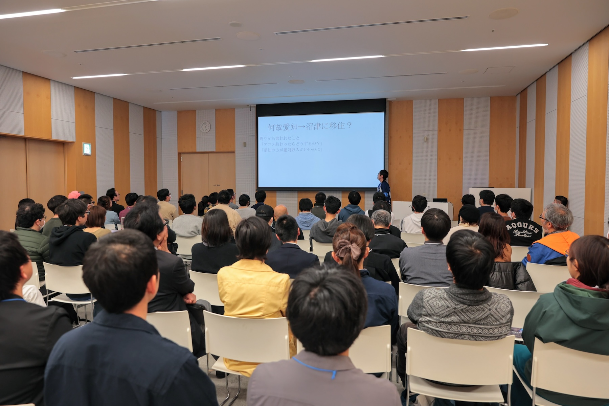
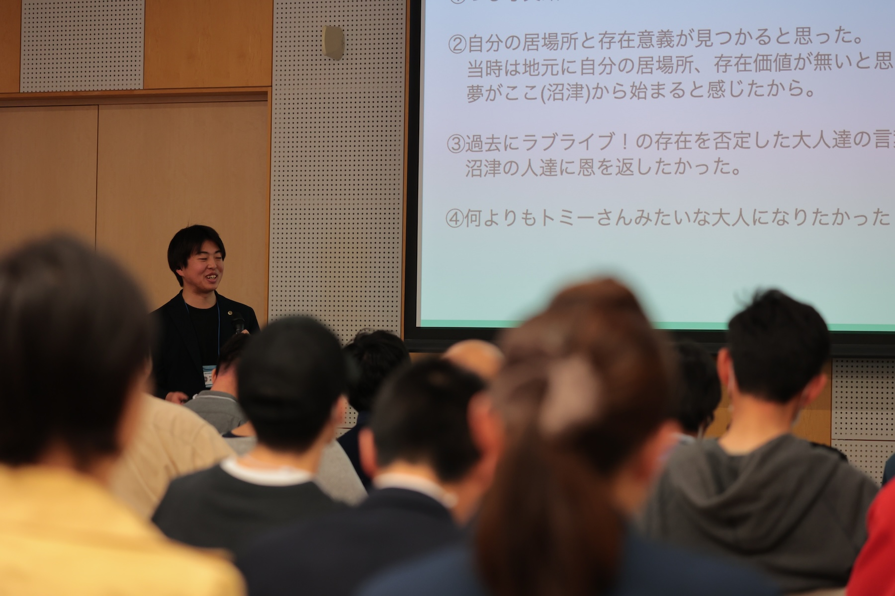
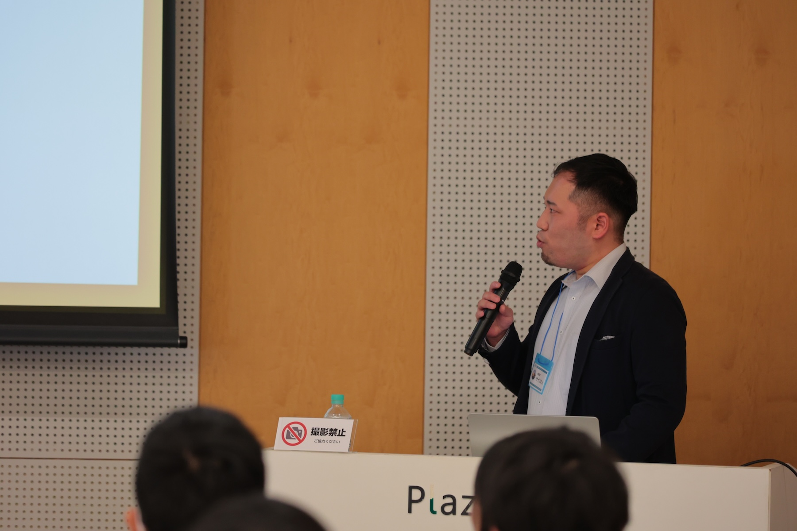
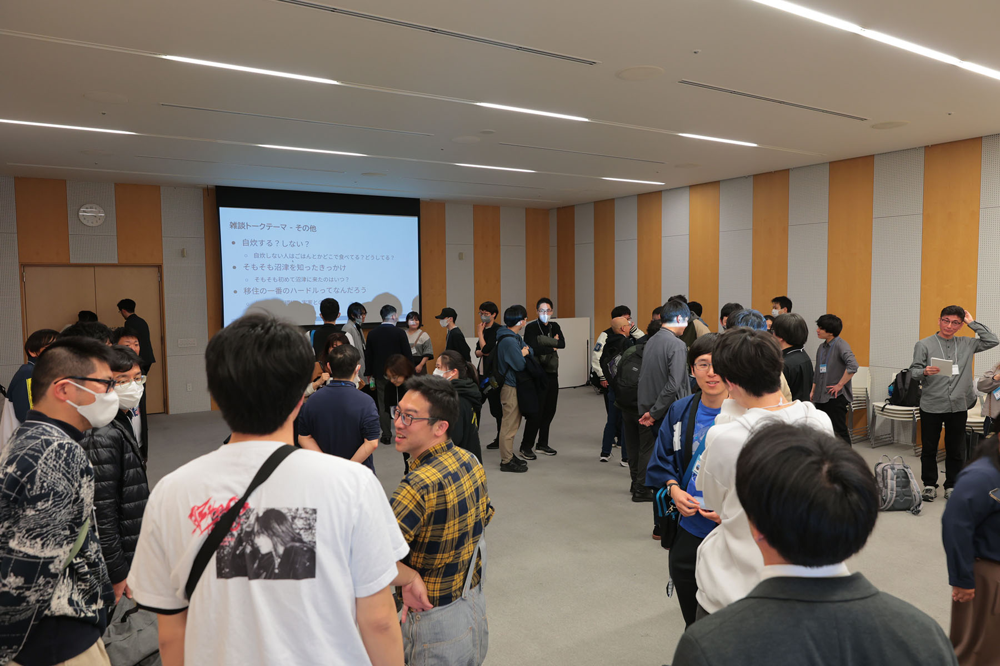
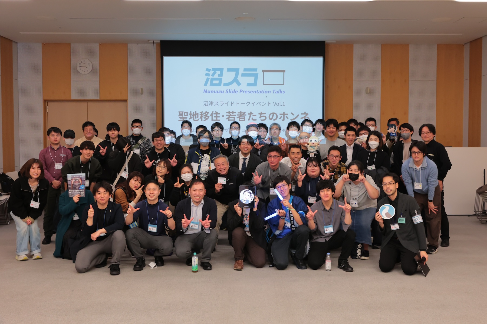

2025年3月30日、プラサヴェルデ コンベンションぬまづにて、「[沼津スライドトークイベント Vol.1『聖地移住・若者たちのホンネ』](/events/202503-numasura01-iju/)」を開催しました。

今回のイベントは、移住者や移住希望者だけでなく、沼津の移住者に関心を持つ地元の方なども参加できるイベントで1、総勢80名が参加。地方移住をテーマとしたイベントとしては、沼津に限らず全国的に見ても類を見ない規模の開催となりました。

まず、本イベントのメインとなる発表セクションでは、立て続けに8名の移住経験者が登壇。それぞれの移住に至るまでの経緯や、移住後のリアルな暮らしについて、スライドを使いながらトークを展開しました。

登壇者の背景は多様で、転職や転勤、リモートワーク、サイドFIRE、そして移住したものの諸事情によって転出した人まで、それぞれがユニークな自身の移住経験・移住後の生活について語り、参加者は真剣に耳を傾けていました。

発表セクションの後に設けられた「雑談タイム」では、会場内をフリースペースとし、参加者同士で交流する時間となりました。登壇者に直接質問する方や、同じ移住者・移住希望者同士で語り合うグループなども見られ、会場のあちこちで新たな交流が生まれていました。

参加者アンケートでは「これまでになかった視点での移住経験や体験談を聞けた」といった声も聞かれ、これまでの移住相談イベントとはまた違う価値を提供することができました。

今後も「沼津移住者コミュニティ うみねこ」では、イベント開催以外にも、沼津への移住に興味がある方、すでに移住してきた方、地域と関わりたい方などが、相互につながれるような活動を継続して行っていく予定です。

今回ご参加いただいた皆さま、何より登壇者の方々、そして本イベントを応援してくださったすべての方に、心より感謝申し上げます。
