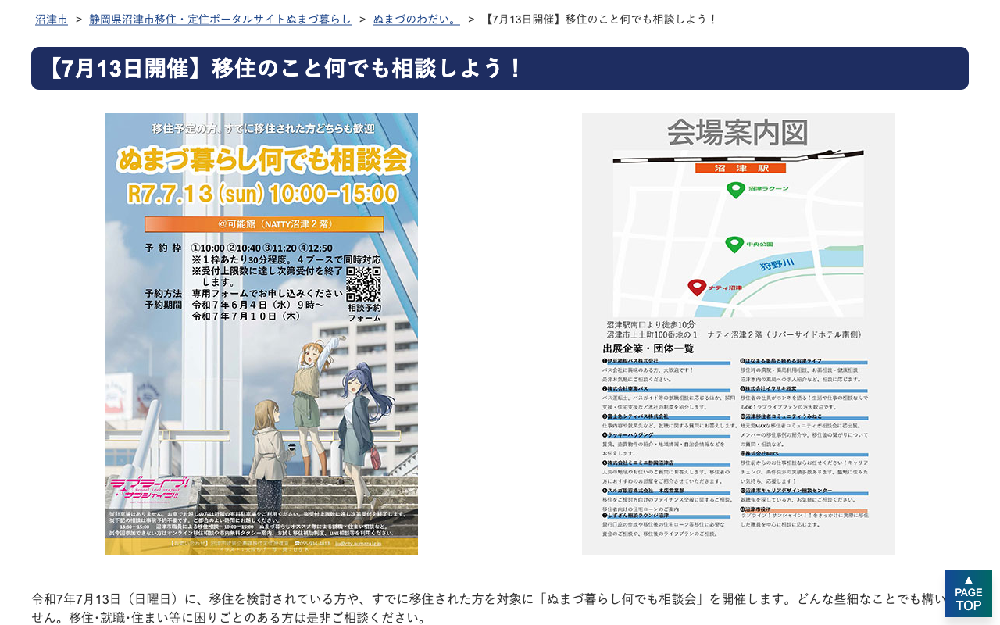

2025年7月13日(日)に、沼津市移住定住推進室の主催で、移住を検討している方や、既に移住した方を対象に「ぬまづ暮らしなんでも相談会」が行われ、その会場にぬまづ暮らしオススメ隊としてうみねこが初めてブースを出展します。

うみねこのブースでは、移住したメンバーの移住事例の紹介や、うみねこのこれまでの活動内容や参加方法のご案内、他の地域コミュニティの紹介の他、 Aqours の Finale ライブの感想戦など、移住前の方だけでなく移住後の方など、どなたでも訪問いただけるブースとする予定ですので、お気軽にお越しください。

### イベント概要

<table class="table">
<tr><th>日時</th><td>2025年7月13日(日)</td></tr>
<tr><th>場所</th><td>可能館（NATTY沼津2階 リバーサイドホテル南側）</td></tr>
<tr><th>ブース展示時間</th><td>10:00〜15:00（予定） <small>※都合によってスタッフが離席している場合もあります</small></td></tr>
<tr><th>参加費</th><td>無料</td></tr>
</table>

本イベントに関するの詳細や他ブースの出展内容、市役所職員への相談の予約については、沼津市移住定住ポータルサイトの特設ページをご確認ください。

- [【7月13日開催】移住のこと何でも相談しよう！ - 静岡県沼津市移住・定住ポータルサイトぬまづ暮らし／沼津市](https://www.city.numazu.shizuoka.jp/shisei/iju/topics/r07/20250713.htm)

<blockquote>

  

  <cite class="cite">静岡県沼津市移住・定住ポータルサイトぬまづ暮らし</cite>

</blockqoute>

