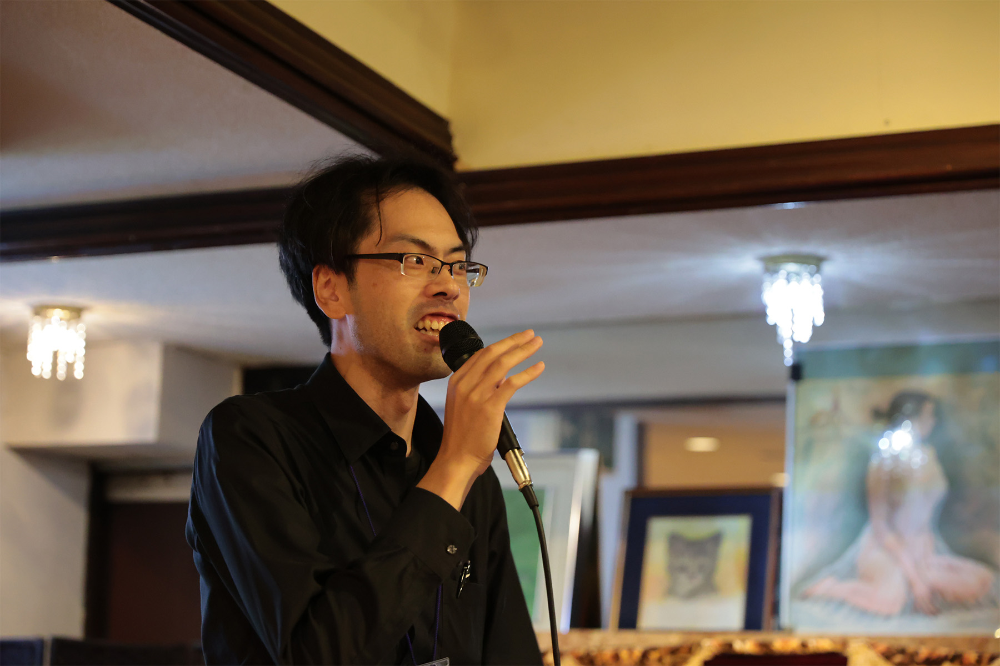

2025年6月29日、うみねこの立ち上げから2周年となったことを記念し、「うみねこ 2nd Anniversary Special Event
うみねこ2周年!! KANPAI! ねこはく trippers ~僕らの定住hours~」を開催しました。

沼津のバー、「[ねこと白鳥](https://bar.nekohaku.com/)」を貸し切りにして行われた今回のイベントは、うみねこのコミュニティメンバーに加え、これまでお世話になった方などをお迎えし、総勢約40名の方にご参加いただきました。

イベントは、参加者同士での交流の他、これまでのうみねこの活動を振り返るパネル展示や、メンバーによるカクテル提供や持ち込みのお酒の試飲のほか、DJブースなども用意され、参加者同士がお互いに様々な話題に花を咲かせている会場全体を、BGMでさらに盛り上げました。

昨年に引き続き、今回も沼津市の市長である頼重秀一氏にもご列席いただき、「DJ YORISHIGE」として音楽を再生していただくなど、イベントを盛り上げていただきました。

改めて今回参加いただいた皆様、また今回のイベント開催に向けてサポートしてくださった沼津の皆様、ありがとうございました。

3年目も引き続き、様々な活動を行ってまいりますので、引き続きよろしくお願いいたします。
