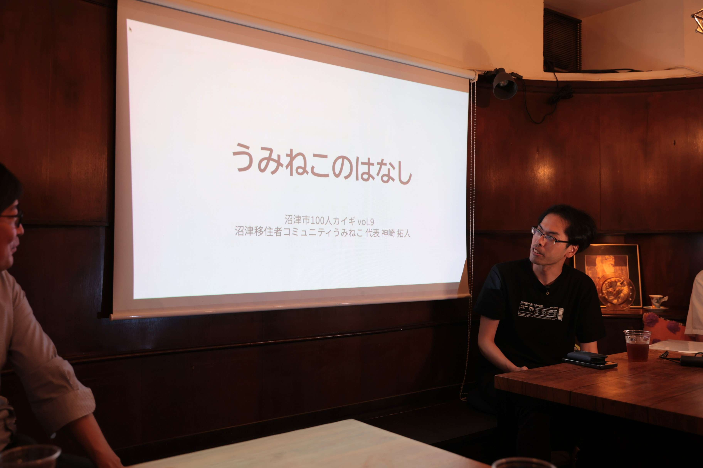

2025年7月8日、 cafe&bar LIFE を会場に行われた [沼津市100人カイギ](https://100ninkaigi.com/area/numazu) [vol.9](https://numazu100vol9.peatix.com/) に、うみねこの代表である神崎が登壇しました。

10分と短い発表でしたが、うみねこの設立に至るまでの経緯や、活動における目標、設立後の個人の心情の変化などをお話させていただきました。

会場では、うみねこの活動に興味を持ってくださった方々と名刺交換をし、今後の連携や協力の可能性についてもお話しすることができました。
