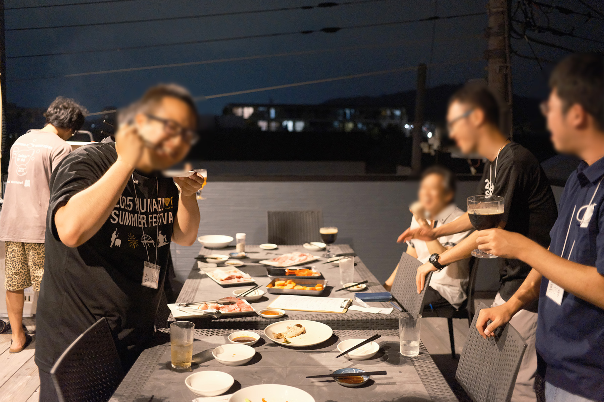
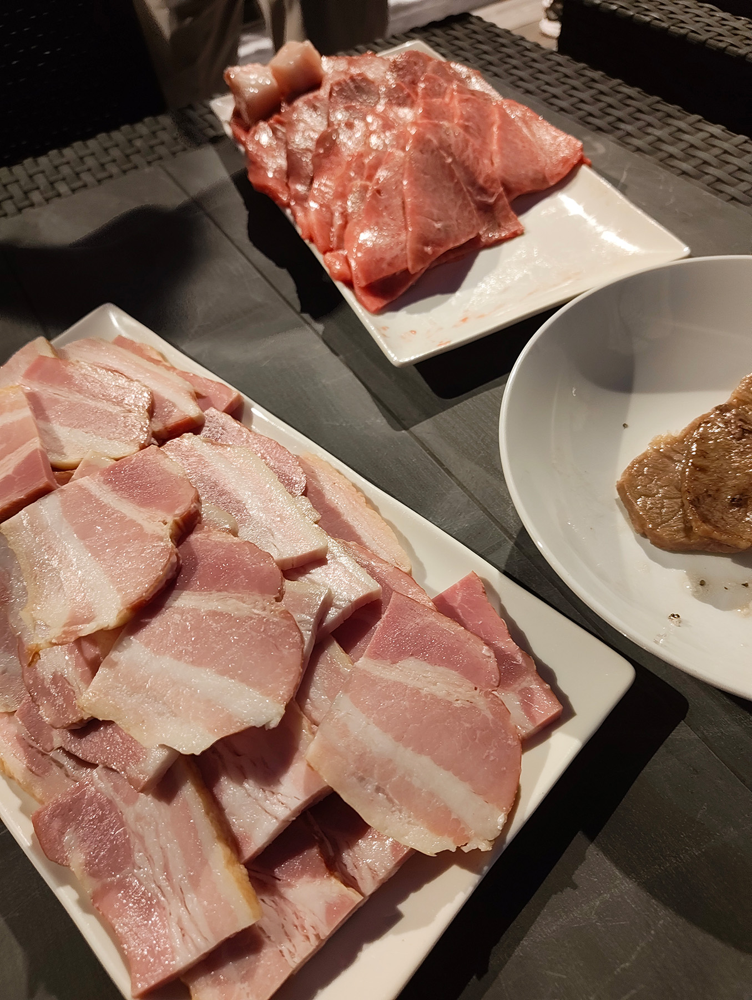
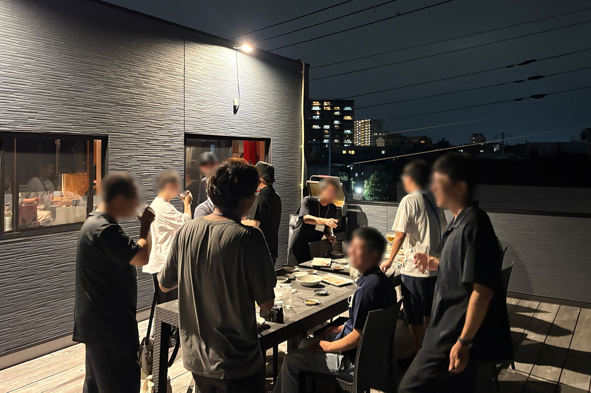

2025年8月23日(土)、うみねこリアル交流イベント「うみねこ会」の第19回を開催しました。

「うみねこ会」は、うみねこのメンバー同士の交流や情報交換を目的として、月に1回程度実施しているリアルイベントです。

第19回目となる今回は、 [昨年の8月にもお世話になった](/news/2024/0817/umineco_11th.html)、 [クラフトサワー＆クラフトビール専門店 SENSPI](https://www.instagram.com/senspi_numazu/) さんの BBQ BEAR GARDEN を利用しました。

総勢17名となった今回は、沼津で食肉を販売する老舗「古安」さんから仕入れたお肉を楽しみながら、沼津クラフト・SENBON SPIRITS さんが提供しているクラフトビールやサワーが飲み放題という、贅沢な内容のセットを楽しみました。

