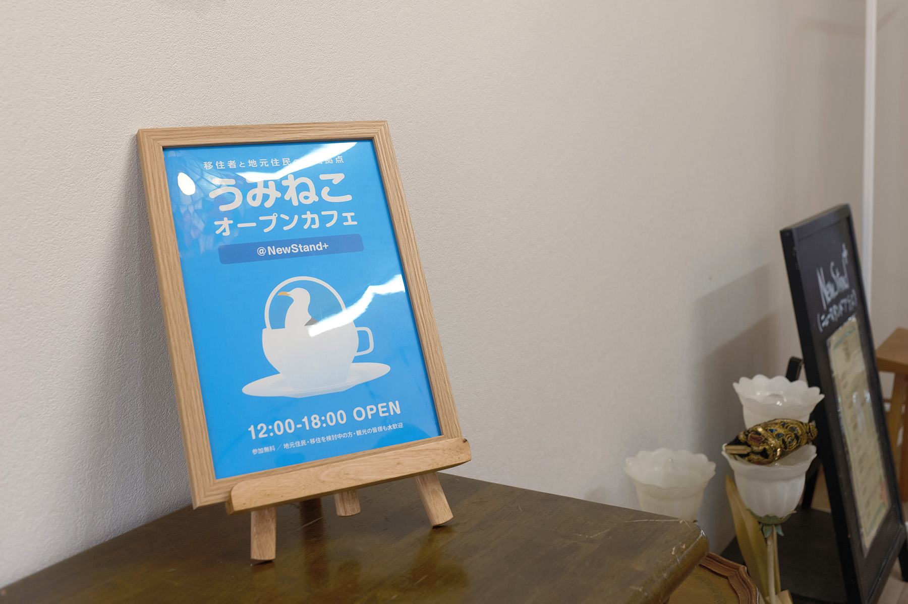
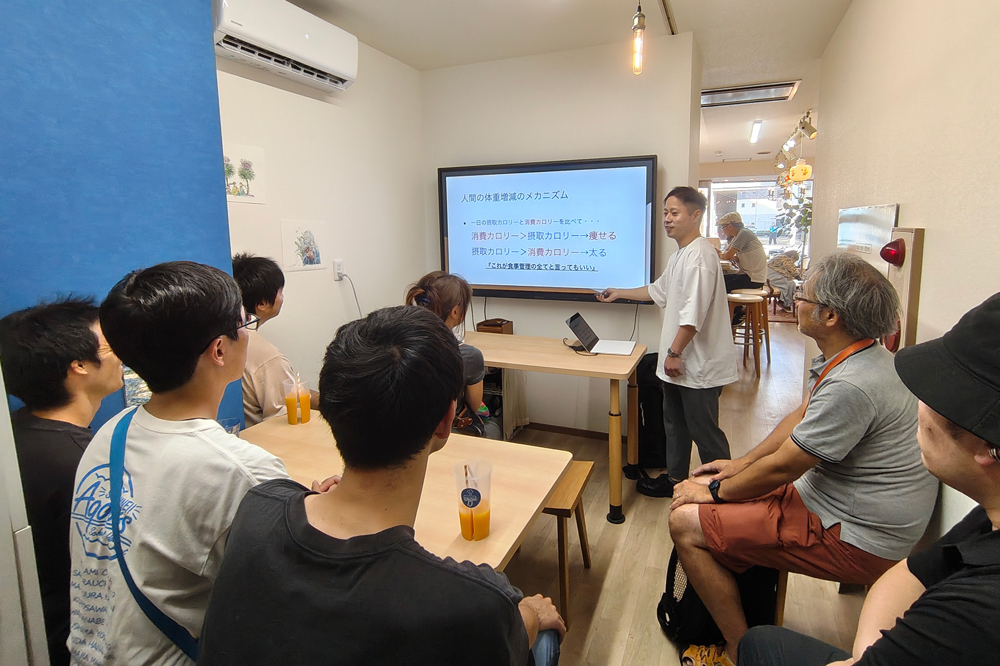
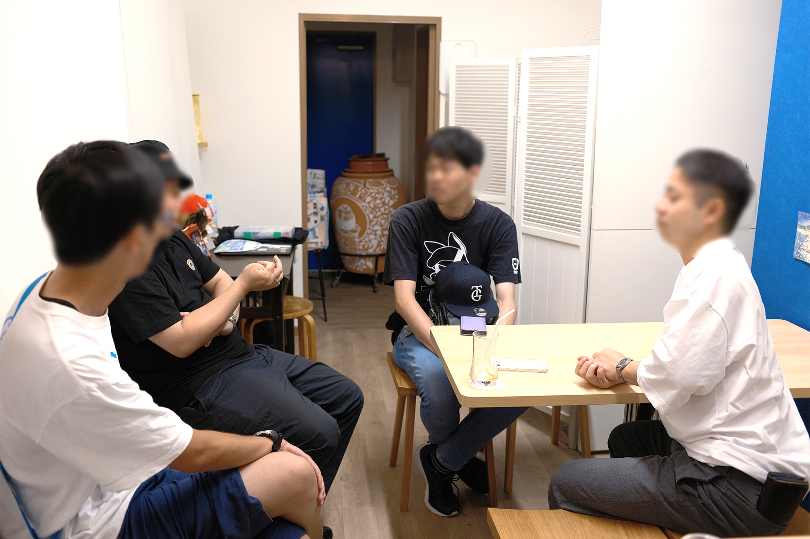

2025年8月23日(土)、沼津経済新聞編集部 NewStand+ さんをお借りして、「うみねこオープンカフェ」の第3回を開催しました。

この取り組みは、移住者の居場所づくりや、地域の人との交流を行うことを目的として、既設のカフェを貸し切って営業を行うという、[沼津市からの助成（マチカツ）を受けて行っている取り組み](/news/20250530/umineco_open_cafe.html)です。

また、今回のミニセミナーは「筋トレ＆ダイエット講座」と題し、1年間に10kgの減量に成功したメンバーが、実際に行ったトレーニング方法や食事管理の方法について発表を行いました。

一時間超にも渡るボリュームフルな内容でしたが、参加者からは「すぐに実践できそう」「モチベーションが上がった」などの声が聞かれました。

セミナーの最後には、講座の中でも紹介されたプロテインを実際に飲んでみる時間があり、初めて飲む人も多いなかで、興味深そうに味わっていました。

うみねこオープンカフェは今後も、月1回開催する予定です。日程は決まり次第順次、うみねこの Discord の他、 SNS やウェブサイトにてお知らせさせていただきます。
