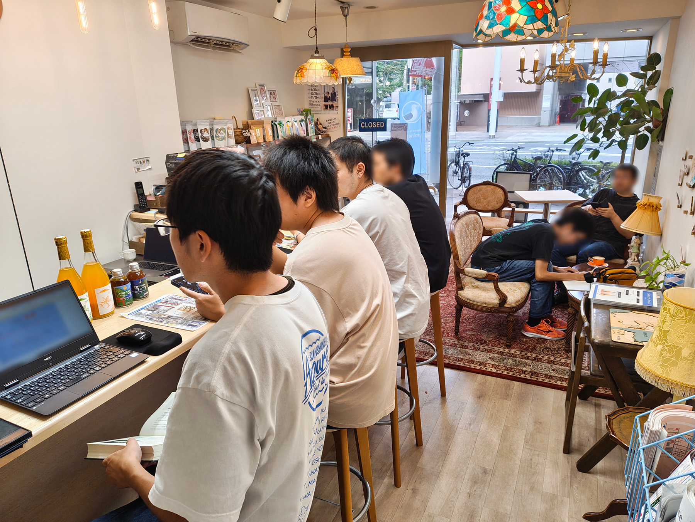
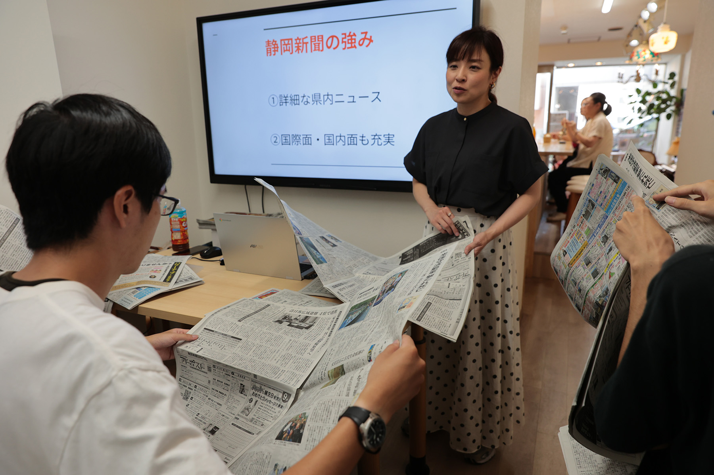
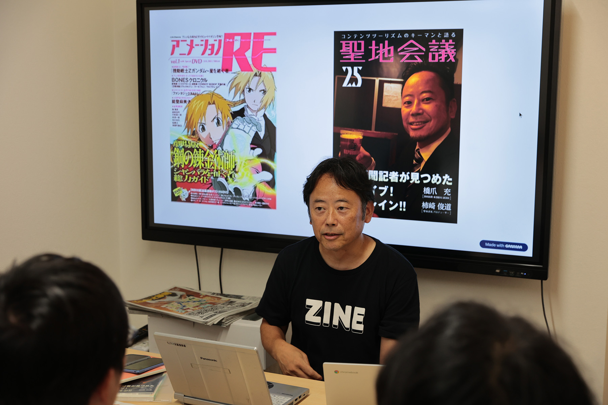

2025年9月15日(土)、沼津経済新聞編集部 NewStand+ さんをお借りして、「うみねこオープンカフェ」の第4回を開催しました。

この取り組みは、移住者の居場所づくりや、地域の人との交流を行うことを目的として、既設のカフェを貸し切って営業を行うという、[沼津市からの助成（マチカツ）を受けて行っている取り組み](/news/20250530/umineco_open_cafe.html)です。

また、今回のミニセミナーは、静岡新聞社の読者プロモーション部から講師をお招きし、「静岡新聞で沼津ライフをより豊かに」と題して、静岡新聞を使った効率的な情報収集の方法や、地域密着の報道機関ならではの強みなどについてお話しいただきました。

普段は紙の新聞を購読していない参加者からは、「新聞を読む習慣がなかったが、10分程度でざっと目を通すだけでも、地域の情報が得られることがわかった」「スマホでニュースを読むことが多いが、紙の新聞にはネットには載っていない情報も多く、改めて購読を検討したい」などの感想が寄せられました。

また、後半にはゲストをしてお越しいただいた 静岡新聞社 橋爪充 論説委員（エキスパート食高度専門記者兼務） より、「ラブライブ！サンシャイン!!と沼津市」についてこれまで取材されてきた立場から、これまでの取材の中で感じたことや、取材当時の裏話といった貴重なお話しをしていただきました。

うみねこオープンカフェは今後も、月1回開催する予定です。日程は決まり次第順次、うみねこの Discord の他、 SNS やウェブサイトにてお知らせさせていただきます。
