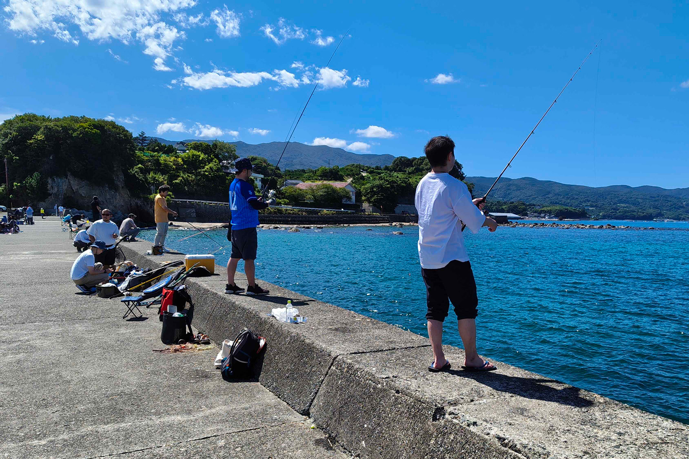
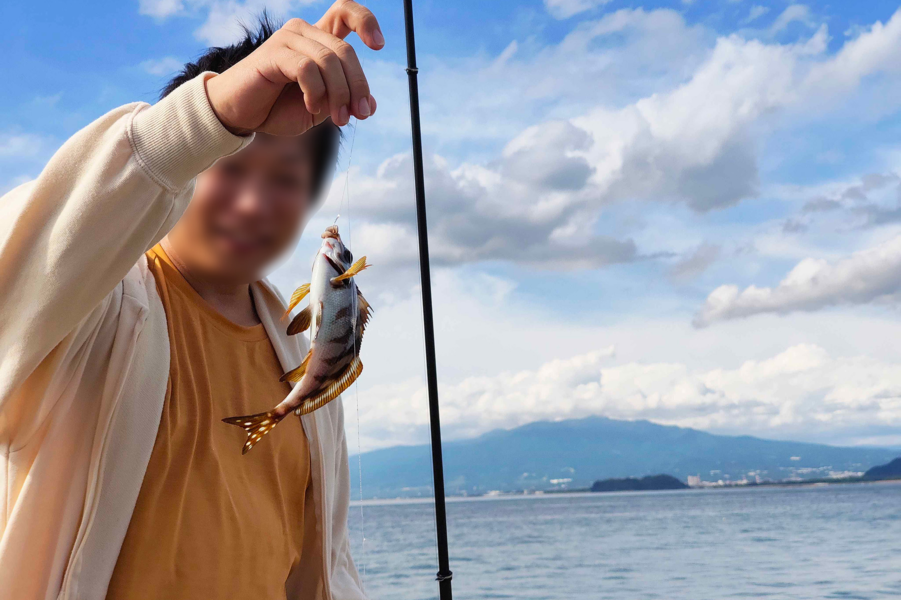
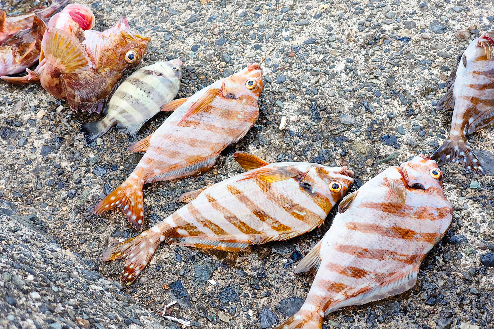
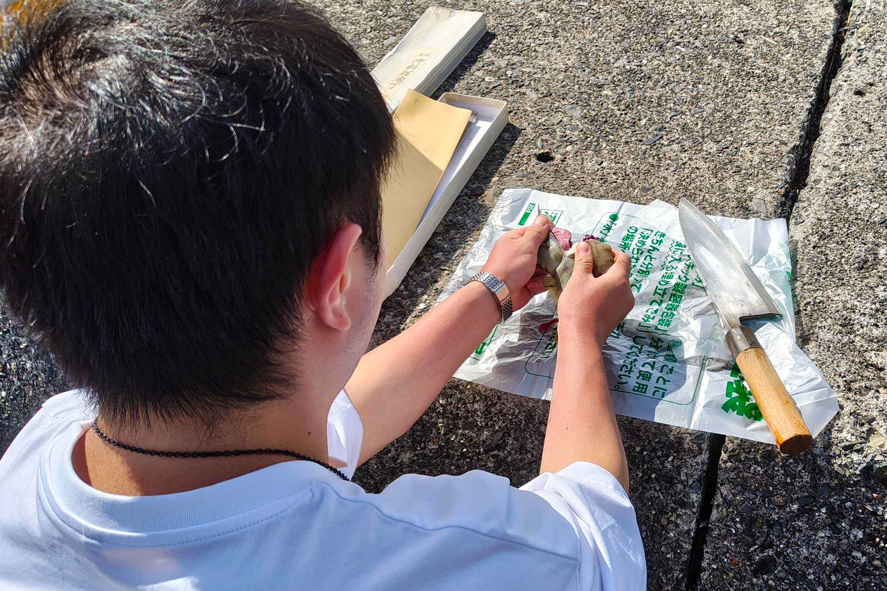

2025年9月21日(日)、沼津市木負にて、うみねこ釣り体験会を開催しました。

今回の釣り体験会は、うみねこメンバーの知人を「釣り経験者」として沼津にお招きし、釣り未経験のうみねこメンバーにいろはを指南してもらう企画として実施しました。

事前の道具購入から、釣り道具の使い方などについて丁寧に指導していただき、参加者全員で初めての釣りを楽しむことができました。

当日は天候にも恵まれ、参加者は経験者の指導を受けながら、投げ釣りやサビキ釣りなど、様々な釣り方に挑戦しました。釣果としては、カサゴなどが釣れ、参加者は自分で釣った魚を手に取り、その感触や重さを実感していました。

また、魚を捌ける移住者がその場で釣った魚を捌いて、刺し身で味わったり、各々持って帰り家で調理したりと、初経験の釣りを存分に楽しむことができました。
