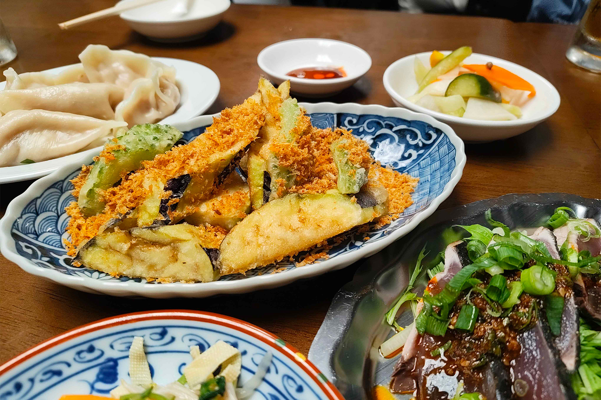
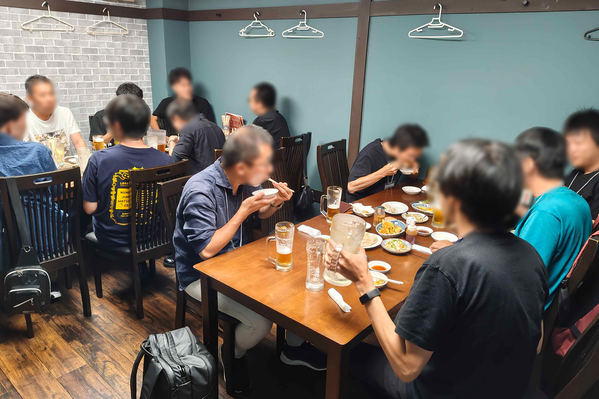

2025年9月27日(土)、うみねこリアル交流イベント「うみねこ会」の第20回を開催しました。

「うみねこ会」は、うみねこのメンバー同士の交流や情報交換を目的として、月に1回程度実施しているリアルイベントです。

13回目となる今回は、「301餃子 沼津駅南口店」さんにて総勢14名で開催しました。

301餃子さんはこれまでもうみねこ会の会場として何度もお世話になっており、リーズナブルでありながら、餃子を中心としたボリューム満点の料理を提供していただけるので、大変おすすめです。

今回も様々な話題で盛り上がりながら、メンバー同士の交流を楽しみました。
