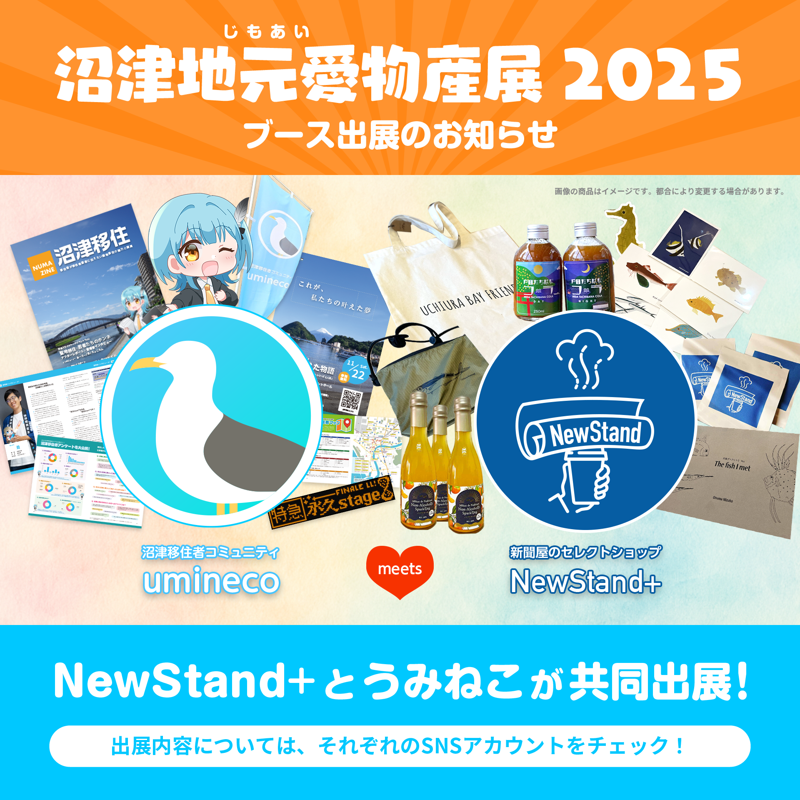
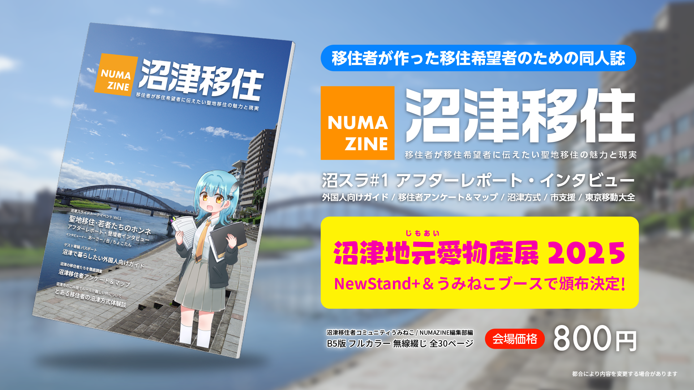
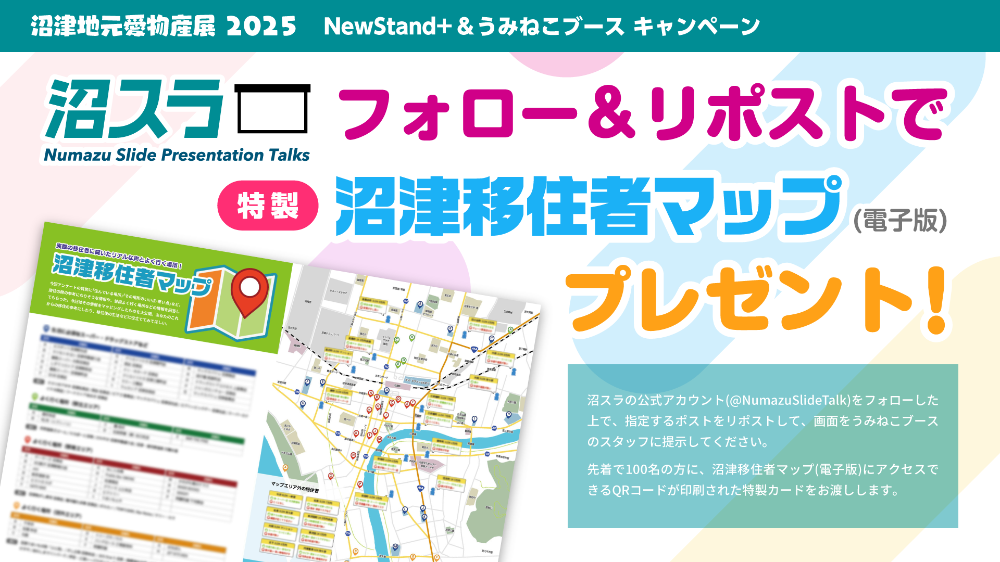

2025年11月1日〜3日の3日間、キラメッセぬまづにて開催される「沼津地元愛物産展 2025」に、うみねこが NewStand+ と共同で出展します。

うみねこブースでは、うみねこ初の同人誌「NUMAZINE 沼津移住」の頒布をはじめ、沼津スライドトークイベントのSNSアカウントフォロー＆リポストキャンペーンなど、様々な企画を予定しています。

### NUMAZINE 沼津移住

沼津移住者コミュニティ うみねこ がお送りする初の同人誌、「NUMAZINE 沼津移住」を頒布します。

今年3月に実施した、「[沼スラ#1 聖地移住・若者たちのホンネ](/news/2025/0330/numasura01-iju-presentation.html)」のアフターレポートを始め、登壇者3名へのインタビュー記事や、移住経験者・総勢25名から集めたアンケート結果など、「聖地移住のリアル」を知ることができる内容となっています。

沼津への移住を検討している方、移住後の生活に不安を感じている方、沼津での暮らしに興味がある方だけでなく、既に沼津に住んでいる方にも楽しんでいただける一冊に仕上がりました。

冊子はB5フルカラーにて、1冊・800円での頒布を予定しています。お支払いはクレジットカード（IC・タッチ）で対応させて頂く予定です。QRコード決済および現金は使えませんのでご注意ください。

### 沼スラフォロー＆リポストキャンペーン

「沼スラ#2 私たちの叶えた物語」の開催を記念し、SNSアカウントのフォロー＆リポストキャンペーンを実施します。

[沼津スライドトークイベント](https://numasura.umineco.org/) の公式Xアカウント [@NumazuSlideTalk](https://x.com/NumazuSlideTalk) をフォローした上で、以下の指定の投稿をリポストしていただいた画面をスタッフに見せて頂いた方へ、「特製・沼津移住者マップ」の電子版にアクセスできるQRコードが印刷されたカードをプレゼントします。

<a href="https://x.com/NumazuSlideTalk/status/1975879294309294390" class="btn btn-lg btn-primary" target="_blank" rel="noopener noreferrer">リポスト指定の投稿はこちら</a>

地元愛物産展ではぜひ、うみねこブースへお立ち寄りください。皆様のご来場を心よりお待ちしております。
