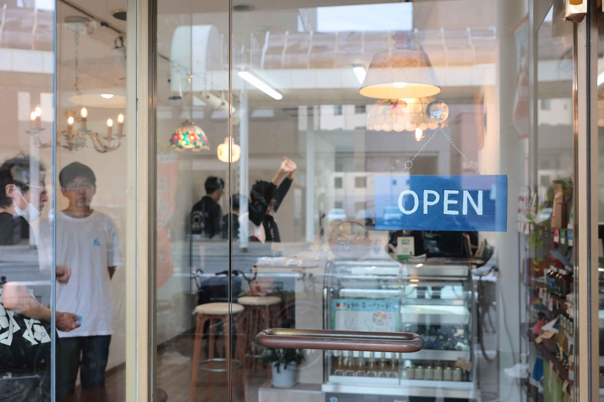
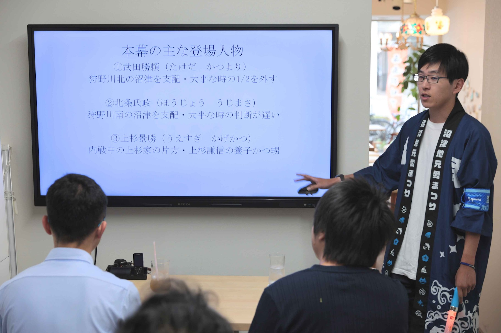
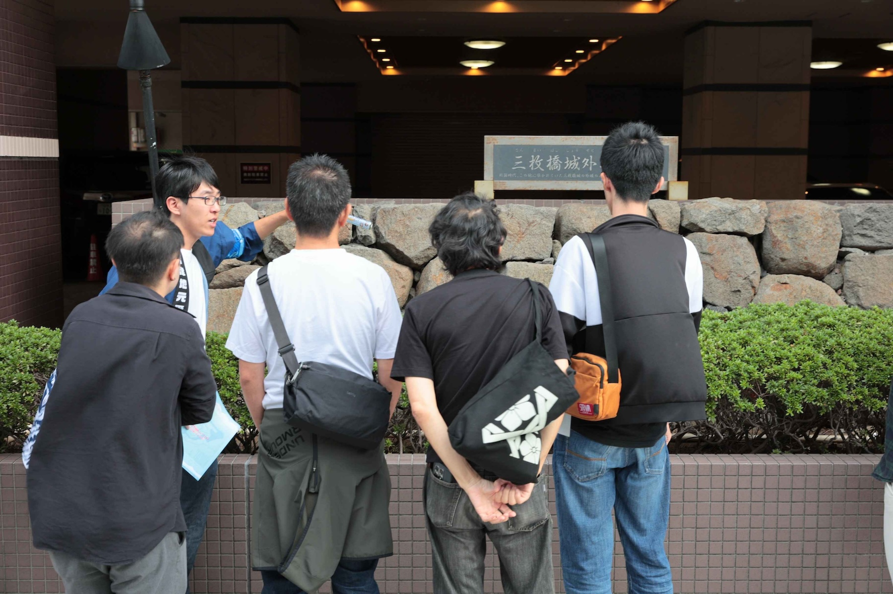

2025年10月18日(土)、沼津経済新聞編集部 NewStand+ さんをお借りして、「うみねこオープンカフェ」の第5回を開催しました。

この取り組みは、移住者の居場所づくりや、地域の人との交流を行うことを目的として、既設のカフェを貸し切って営業を行うという、[沼津市からの助成（マチカツ）を受けて行っている取り組み](/news/20250530/umineco_open_cafe.html)です。

毎回恒例となっているミニセミナーでは、「沼津城の歴史セミナー 〜What is Numazu Castle LIFE?〜」と題し、うみねこのメンバーが沼津中央公園付近にかつて存在していた沼津城の歴史についての解説を行いました。

セミナーでは、沼津城がその場所に出来た理由に始まり、歴代の城主、城の構造や役割、当時の人々による受け止められ方などについて、資料やグループワークを交えながら1時間に渡り、解説を行いました。

また、セミナー後にはミニ・フィールドワークとして、実際に沼津城があった地域を散策しながら、保存されている城壁や、城の構造の痕跡などを見学しました。

地域住民の方にも参加していただき、大変盛況のうちに終了しました。参加者からは、「沼津城については知っていたが、お城がない時代があったことは初めて知った」「普段あまり意識していなかった場所に、歴史的な背景があることを知れて面白かった」などの感想が寄せられました。

うみねこオープンカフェは今後も、月1回開催する予定です。日程は決まり次第順次、うみねこの Discord の他、 SNS やウェブサイトにてお知らせさせていただきます。
