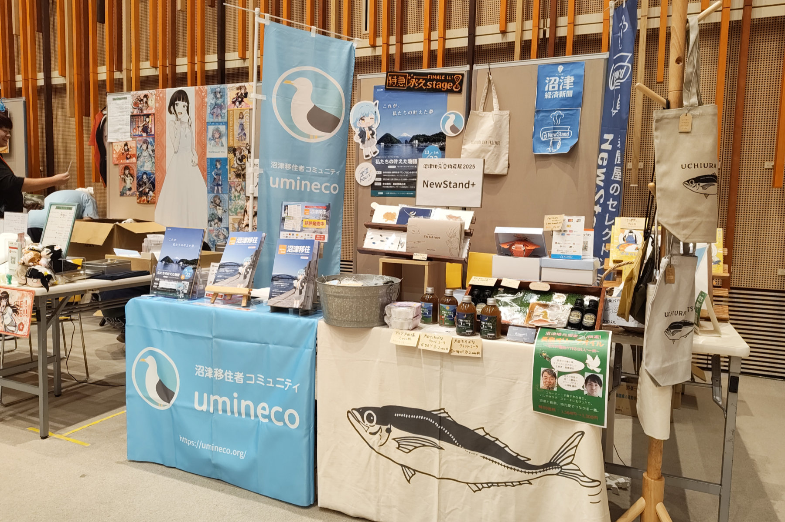
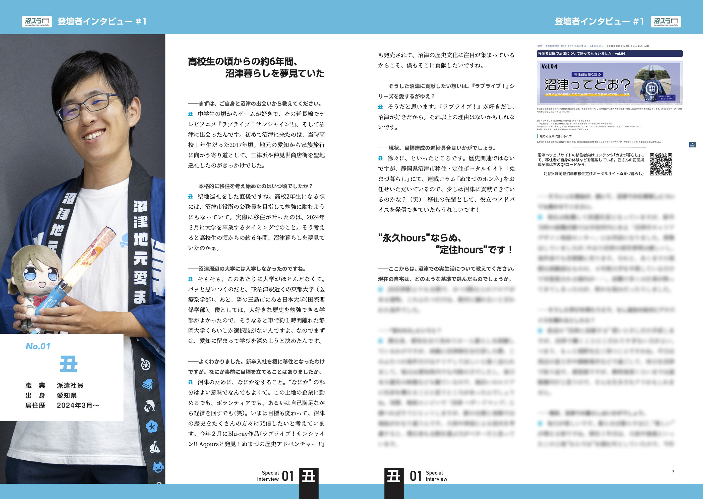

2025年11月1日から3日にかけて、プラサヴェルデで開催された「沼津地元愛物産展 2025」にて、うみねこ初の同人誌、「NUMAZINE 沼津移住」を頒布しました。

沼津地元愛物産展は、同日にとなりのキラメッセぬまづにて開催される「沼津地元愛まつり」と連携したイベントで、沼津市内の大小さまざまな事業者が出展し、地元の魅力を発信する場となっています。今回弊団体では、 NewStand+ さんのブースを間借りして参加しました。

「NUMAZINE 沼津移住」は、沼津市への移住をテーマにした同人誌で、沼津市の魅力や移住に関する情報をまとめています。誌面では、実際に沼津市に移住した方々のインタビューや、地元のおすすめスポット、生活情報などを掲載し、移住を検討している方々に向けて役立つ情報を提供しています。

イベント期間中、多くの来場者方々が「NUMAZINE 沼津移住」に興味を持っていただきました。特に、移住を考えている方々からは、具体的な生活情報や地元の雰囲気を知ることができる点が好評でした。

今回の頒布を通じて、沼津市の魅力をより多くの人々に伝えることができ、また、移住に関する関心を高める一助となったことを嬉しく思います。今後も、地域の魅力を発信し続ける活動を展開していく予定です。
