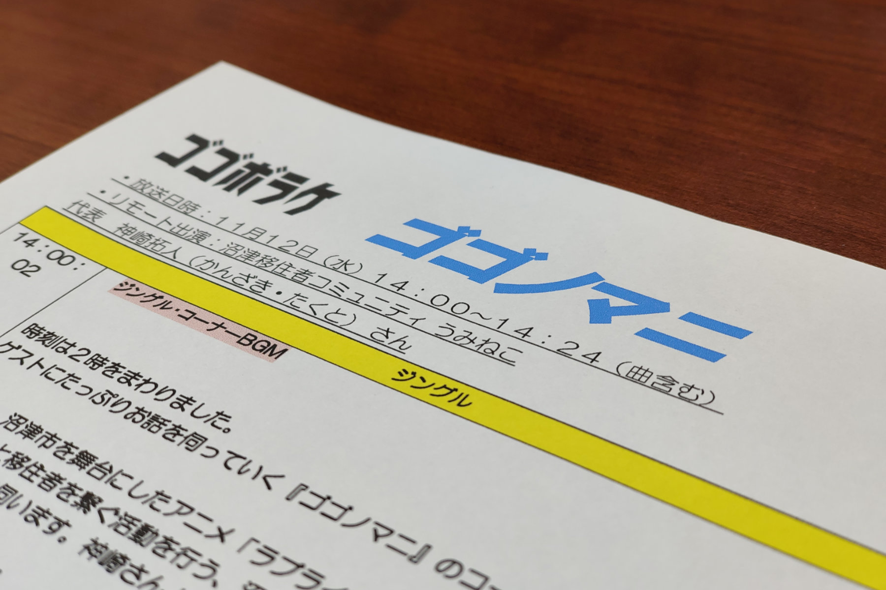

2025年11月12日(水)、SBSラジオの番組「ゴゴボラケ」に、うみねこ代表の神崎がゲスト出演しました。

番組内の「ゴゴノマニ」コーナーにて、神崎自身の移住体験談や、うみねこの活動内容についてお話しさせていただきました。また、11月22日に行われる「[沼津スライドトークイベント](https://numasura.umineco.org)」の告知も行わせていただき、放送中にはリスナーの方から多くの感想やメッセージなどをいただきました。

