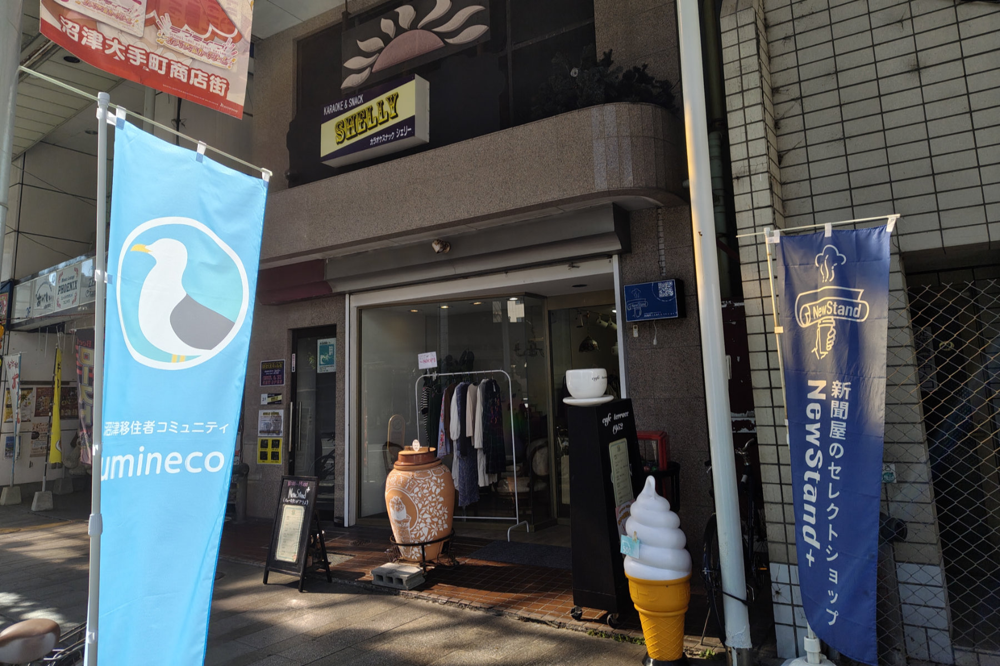
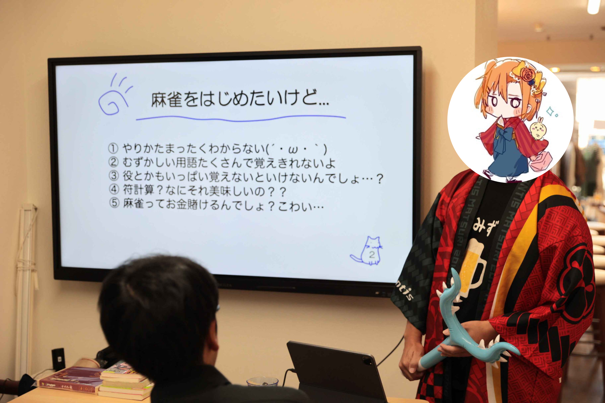
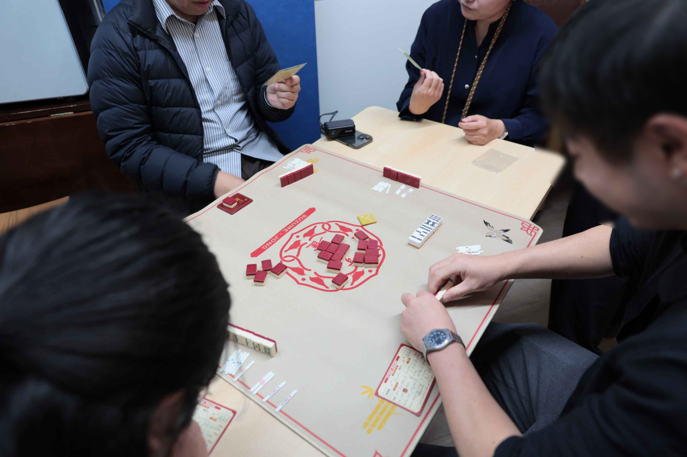

2025年11月15日(土)、沼津経済新聞編集部 NewStand+ さんをお借りして、「うみねこオープンカフェ」の第6回を開催しました。

この取り組みは、移住者の居場所づくりや、地域の人との交流を行うことを目的として、既設のカフェを貸し切って営業を行うという、[沼津市からの助成（マチカツ）を受けて行っている取り組み](/news/20250530/umineco_open_cafe.html)です。

毎回恒例となっているミニセミナーでは、「麻雀を始めてみよう！講座」と題し、うみねこのメンバーが麻雀の歴史や成り立ちについて解説しました。

セミナーでは、麻雀の歴史の他に、初心者向けにルールの学び方の紹介や、どうやって始めるのが良いかなどについても説明しました。参加者からは、「麻雀の歴史について初めて知ることができて面白かった」などの感想が寄せられました。

また、セミナー後には「すずめ雀」という、麻雀初心者でも楽しめるミニマルなルールの麻雀風のゲームを体験する時間が設けられ、参加者同士で白熱した戦いを繰り広げていました。

うみねこオープンカフェは今後も、月1回開催する予定です。日程は決まり次第順次、うみねこの Discord の他、 SNS やウェブサイトにてお知らせさせていただきます。
