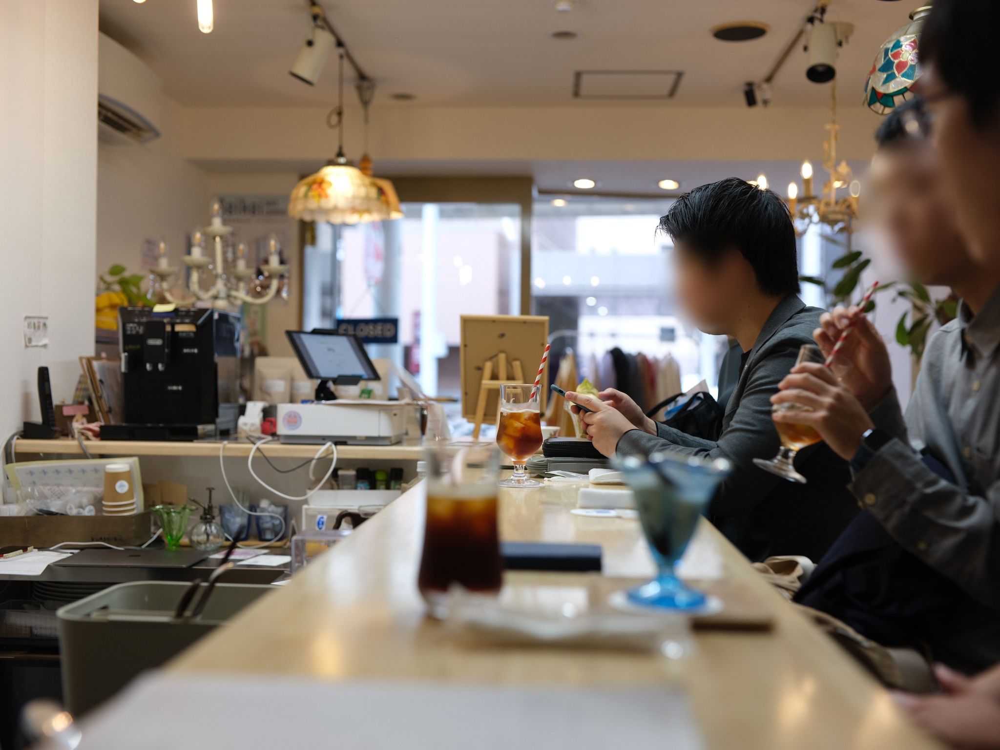
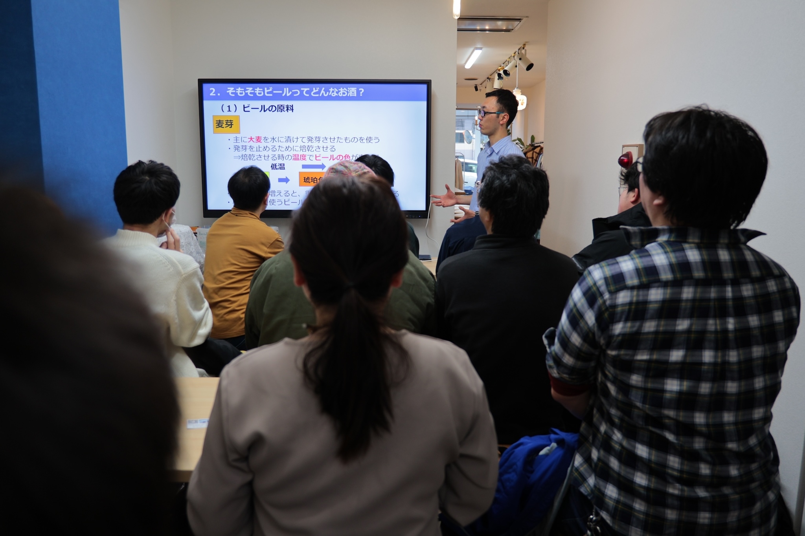

2025年12月20日(土)、沼津経済新聞編集部 NewStand+ さんをお借りして、「うみねこオープンカフェ」の第7回を開催しました。

この取り組みは、移住者の居場所づくりや、地域の人との交流を行うことを目的として、既設のカフェを貸し切って営業を行うという、[沼津市からの助成（マチカツ）を受けて行っている取り組み](/news/20250530/umineco_open_cafe.html)です。

毎回恒例となっているミニセミナーでは、「クラフトビールに沼ってみた！講座」と題し、うみねこのメンバーがクラフトビールの歴史や沼津近辺のブルワリーについて解説しました。

セミナーでは、クラフトビールの発祥から近年のブームに至るまでの歴史を解説したほか、沼津や伊豆近辺にあるブルワリーと、そこで造られている特徴的な銘柄についても紹介しました。参加者からは、「地元のブルワリーについて詳しく知れて良かった。これから飲むのが楽しみ」などの感想が寄せられました。

うみねこオープンカフェは今後も、月1回開催する予定です。日程は決まり次第順次、うみねこの Discord の他、 SNS やウェブサイトにてお知らせさせていただきます。
