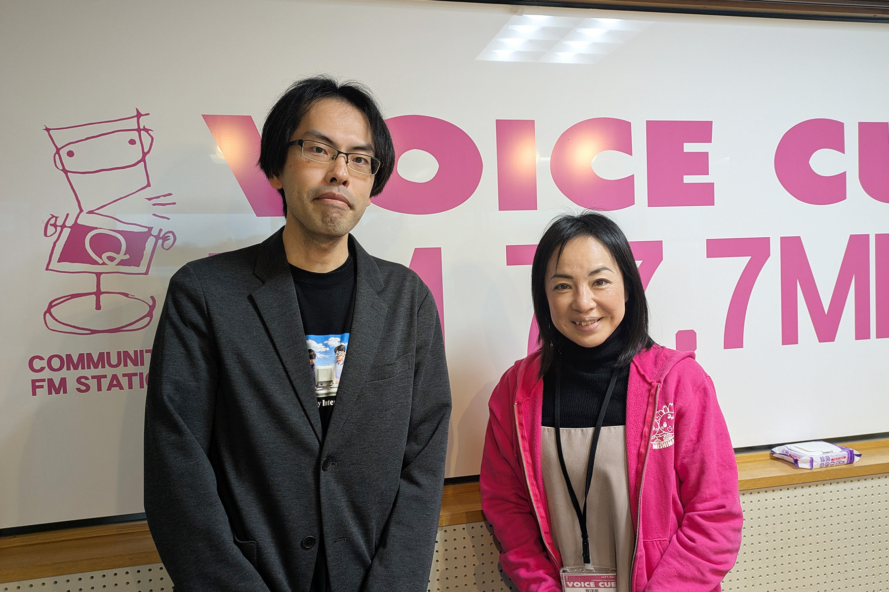

2025年1月15日に、コミュニティFM「ボイス・キュー」様のお昼の情報番組「ukiukiワイドももいろクラブ」内「なないろゲスト」のコーナーに、代表のじゅりあんこと神崎がスタジオ出演しました。

番組では、神崎が移住してきた経緯や、うみねこの立ち上げに至るまでの背景、そして現在の活動内容についてお話しさせていただきました。

放送内容につきましては、[ボイス・キュー様の番組ブログにも掲載していただいております](https://777fm.com/blog/post-16690/)。

うみねことしてメディア出演は初めての経験でしたが、パーソナリティ・スタッフの方々の温かいサポートのおかげで、緊張しながらも無事に収録を終えることができました。今回の出演をきっかけに、より多くの方に私たちの活動を知っていただけることを願っています。

