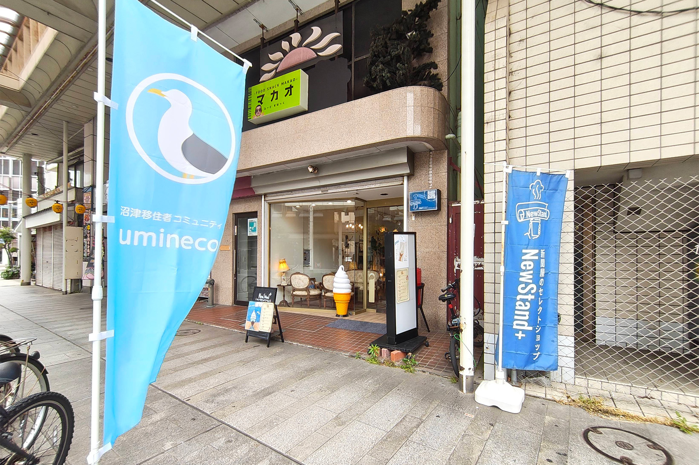
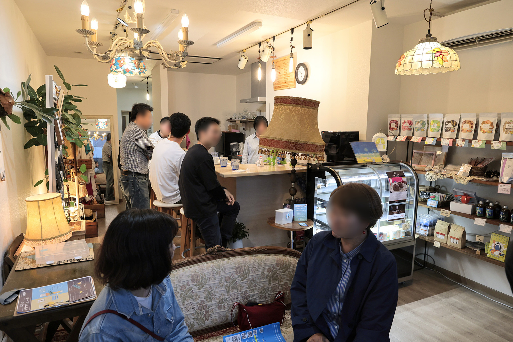
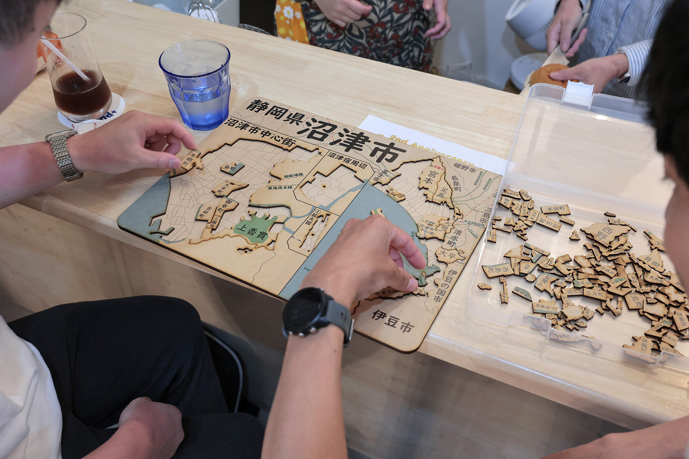

2025年5月24日(土)、沼津経済新聞編集部 NewStand+ さんをお借りして、「うみねこオープンカフェ」の第0回（お試し回）を開催しました。

この取り組みは、移住者の居場所づくりや、地域の人との交流を行うことを目的として、既設のカフェを貸し切って営業するという、弊団体による新しい取り組みです。

6月から本格始動予定のこの取り組みですが、今回はそのお試し回として実施しました。1日で15名の方々にご来場いただき、交流を楽しんでいただきました。

6月以降の実施日程については、詳細が決まり次第うみねこの Discord の他、 SNS やウェブサイトにてお知らせさせていただきます。

