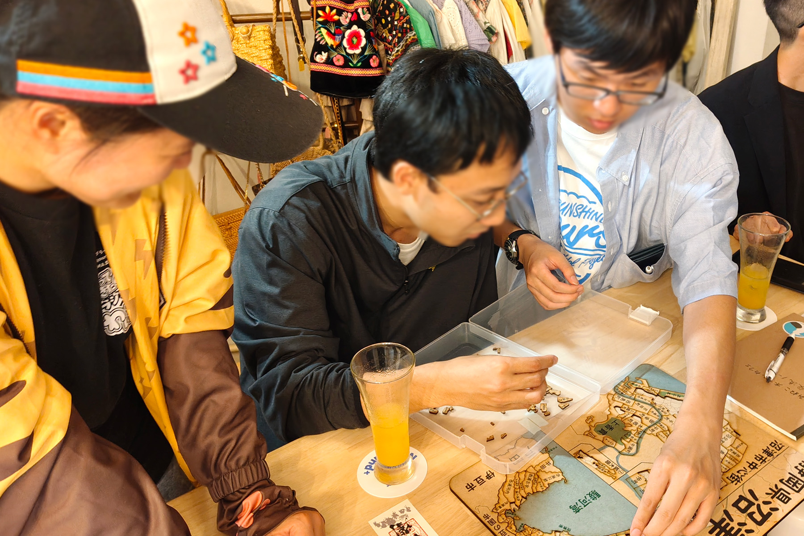

2025年6月14日(土)、沼津経済新聞編集部 NewStand+ さんをお借りして、「うみねこオープンカフェ」の第1回を開催しました。

この取り組みは、移住者の居場所づくりや、地域の人との交流を行うことを目的として、既設のカフェを貸し切って営業を行うという、[沼津市からの助成（マチカツ）を受けて行っている取り組み](/news/20250530/umineco_open_cafe.html)です。

5月にお試し回を経て、今回から本格始動となりましたが、うみねこの交流会に初めて参加される方も来店するなどもあり、にぎわいを見せました。

また、ミニセミナーとして、今回は「アニソンDJ講座」と題し、DJ機材の使い方や、曲のつなぎ方の種類について、移住者のメンバーが講師役となって実演や発表を行いました。

セミナーの最後には受講者が実際のDJ機材を触れる時間があり、初めて触る機械に戸惑いながらも、曲をつなげられると、会場から拍手が沸き起こっていました。

うみねこオープンカフェは今後も、月1回開催する予定です。日程は決まり次第順次、うみねこの Discord の他、 SNS やウェブサイトにてお知らせさせていただきます。
