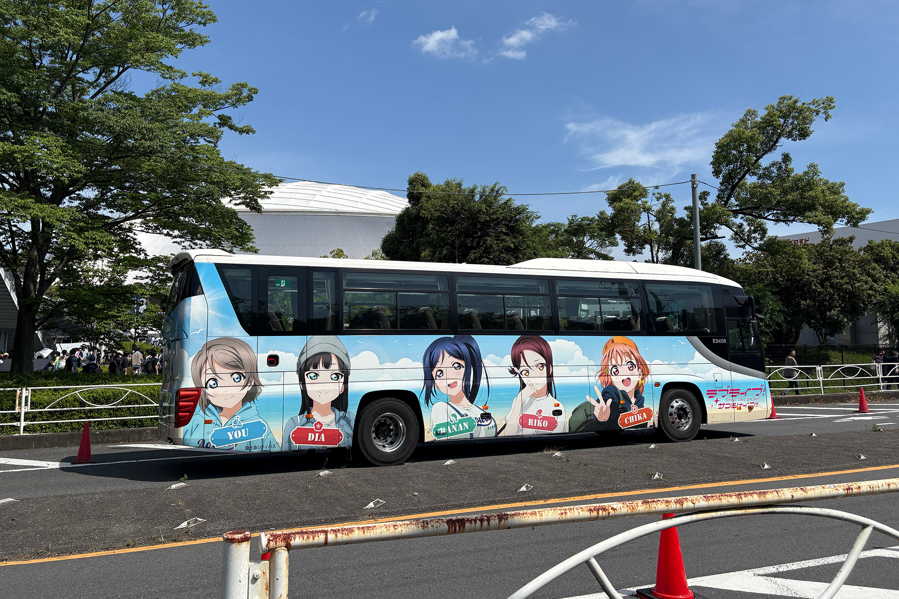
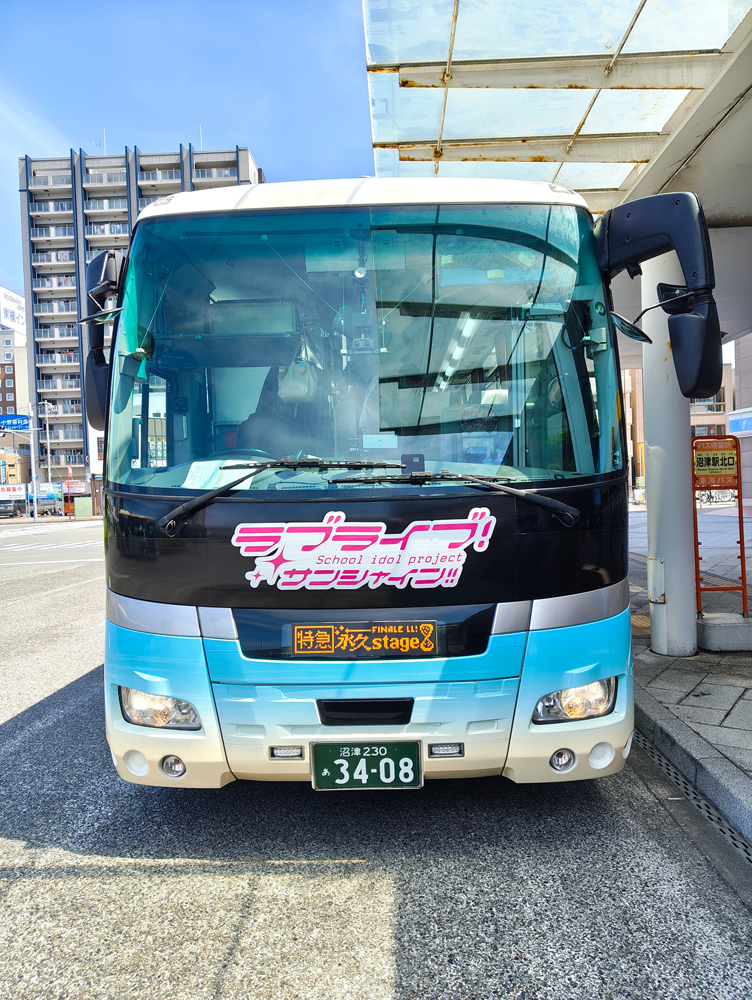
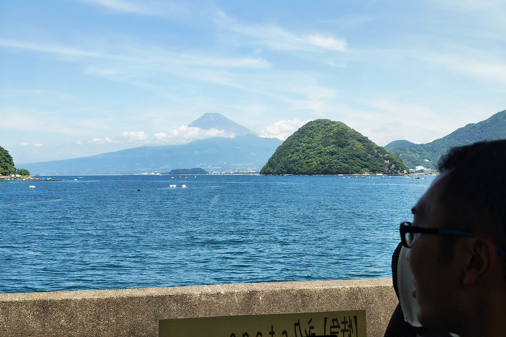
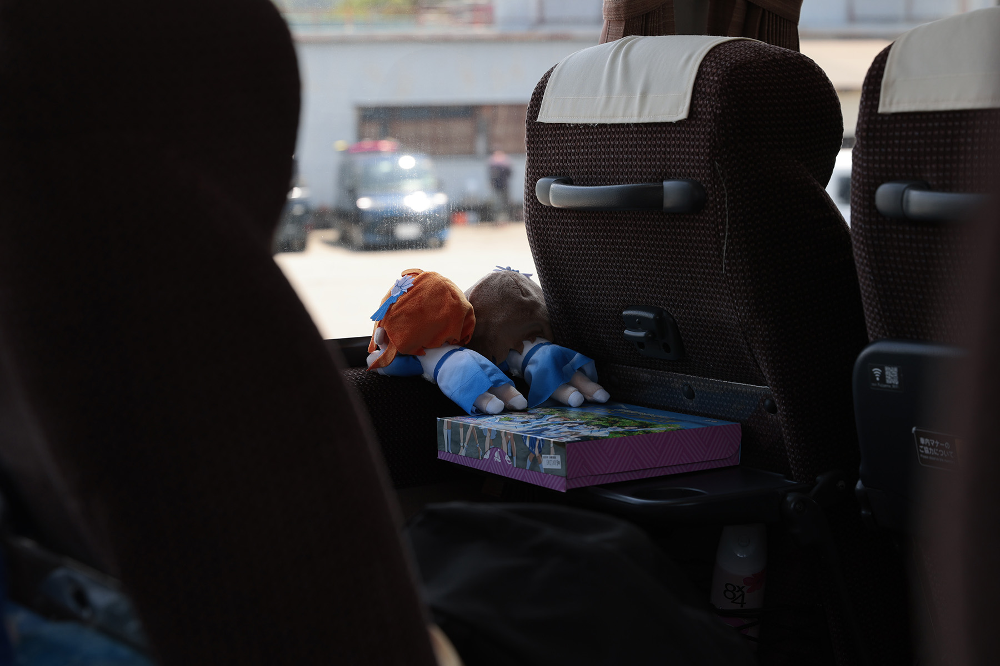

2025年6月21日、埼玉県のベルーナドームで行われた、「Aqours Finale LoveLive! 〜永久stage〜」の Day.1 の会場へ向かうため、富士急シティバス様所有のラブライブ！サンシャイン!!ラッピング仕様の高速バス(E3408)の貸切運行を、有志一同で行いました。

本貸し切り運行は、「【特急】永久stage」と名付け、沼津駅北口から出発し、作品に主人公たちが通う学校「浦の星女学院高校」のモデルとなった、長井崎小中一貫学校のバス停前を経由して、 Finale ライブの会場となるベルーナドームへ向かう行程でした。

天候にも恵まれ、作品の舞台となった内浦から見える富士山や青い海の景色を心に留め、 Finale ライブの会場まで向かう道中、車内ではそれぞれが思い思いの時間を過ごしていました。

今回の運行にあたり、企画にご協力いただいた富士急トラベル様、及び車両を保有していらっしゃる富士急シティバス様、運転手の方をはじめとし、今回のバスの運行にご尽力いただいた皆様、そして何よりご乗車いただいた皆様、ありがとうございました。

### 本企画に関するご案内

* 本企画は、沼津移住者コミュニティうみねこによる企画です。プロジェクトラブライブ！サンシャイン!!様とは一切関係なく、作品のファンによる独自のものです
* 旅行業法、及び会場での混乱を避けるため、参加者の募集は一般に行わず、団体スタッフから直接お声がけできる方に限らせていただきました
* 企画に関するすべての問い合わせは、本ページ下部に記載の連絡先までお願いします。富士急トラベル株式会社様、富士急シティバス株式会社様、及びプロジェクトラブライブ！サンシャイン!!様への直接の問い合わせはご遠慮ください
