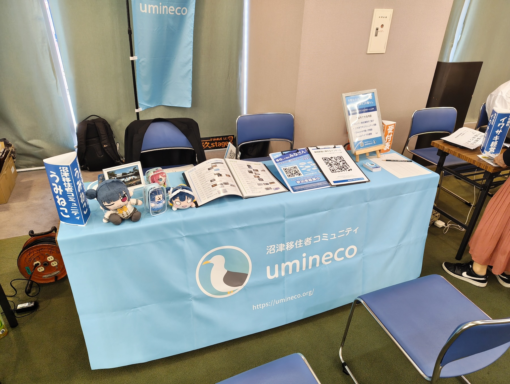

2025年7月13日、沼津市移住定住推進室の主催で、移住を検討している方や、既に移住した方を対象に「[ぬまづ暮らし何でも相談会](https://www.city.numazu.shizuoka.jp/shisei/iju/topics/r07/20250713.htm)」が開催され、その会場にぬまづ暮らしオススメ隊としてうみねこがブース出展を行いました。

市役所職員による移住相談ブースをメインに、沼津市を中心にバス・タクシーを運行する会社や、銀行・不動産仲介会社など、移住のためのサポートを行う会社も多い中、今回から移住後の方の参加もOKのイベントとなったことで、多くの方が来場していました。

弊団体のブースでは、団体概要の説明とこれまでの活動の紹介や、メンバーの移住事例に基づいた相談などを行い、多くの方に来場していただきました。

今後も市などと連携し、移住相談のイベントなどで出展してまいりますので、ぜひお越しください。

また、うみねこでは Discord にて常時オンラインにて移住に関する相談を受け付けております。移住前の方のご参加も歓迎いたしますので、ぜひご利用ください。
