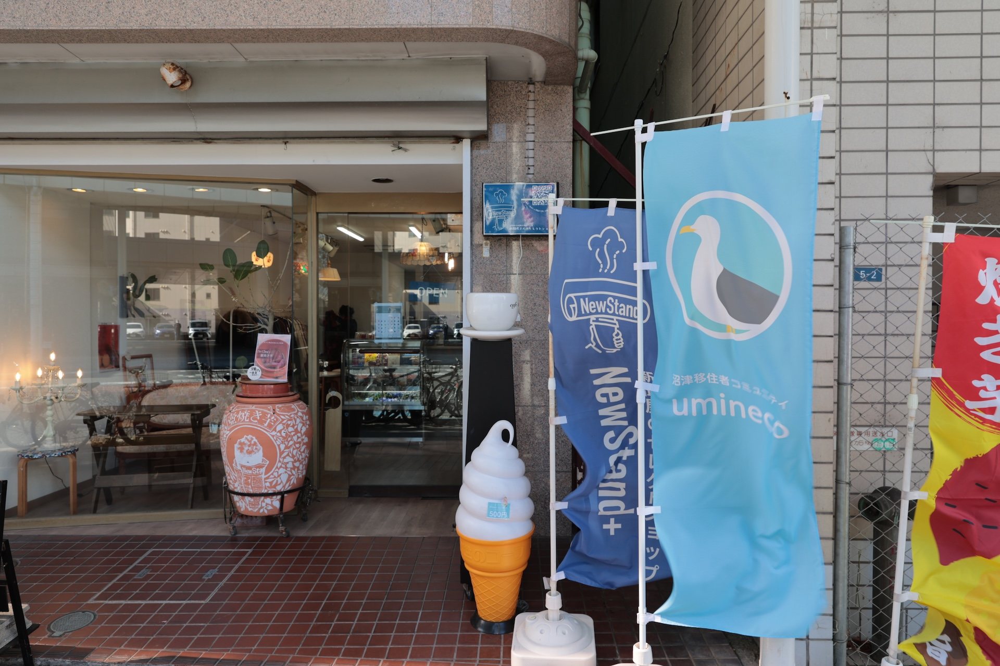
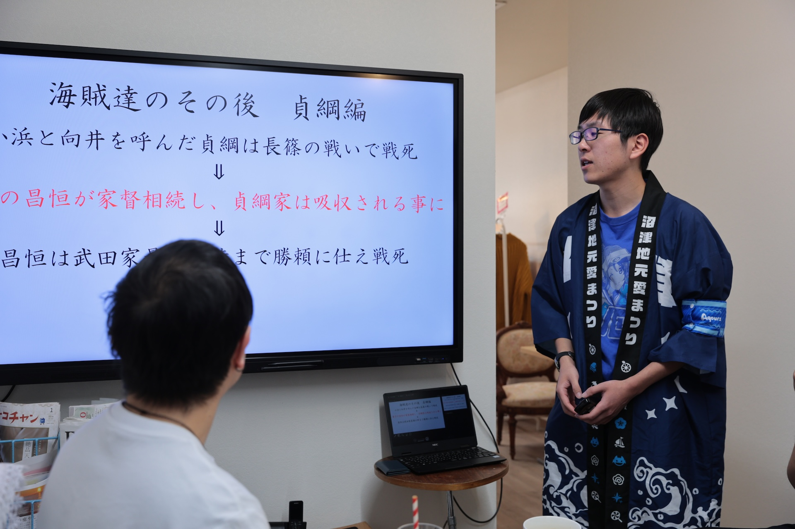

2026年1月24日(土)、沼津経済新聞編集部 NewStand+ さんをお借りして、「うみねこオープンカフェ」の第8回を開催しました。

この取り組みは、移住者の居場所づくりや、地域の人との交流を行うことを目的として、既設のカフェを貸し切って営業を行うという、[沼津市からの助成（マチカツ）を受けて行っている取り組み](/news/20250530/umineco_open_cafe.html)です。

毎回恒例となっているミニセミナーでは、「駿河湾の『海賊』達」と題し、うみねこのメンバーが駿河湾で活躍した『海賊』達の歴史や、時の権力者に翻弄された当時の民衆について詳しく解説しました。

うみねこオープンカフェは今後も、月1回開催する予定です。日程は決まり次第順次、うみねこの Discord の他、 SNS やウェブサイトにてお知らせさせていただきます。
