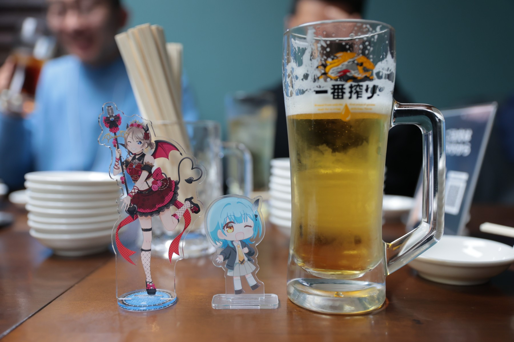

2026年2月21日(土)、うみねこリアル交流イベント「うみねこ会」の第25回を開催しました。

「うみねこ会」は、うみねこのメンバー同士の交流や情報交換を目的として、月に1回程度実施しているリアルイベントです。

今回は、過去回でもお世話になっている「301餃子 沼津駅南口店」にて開催し、総勢23名が参加しました。参加人数としては過去最大規模となり、大変賑やかで楽しい会となりました。

おいしい餃子を囲みながら、様々な話題で盛り上がることができ、あっという間の時間を過ごしました。
