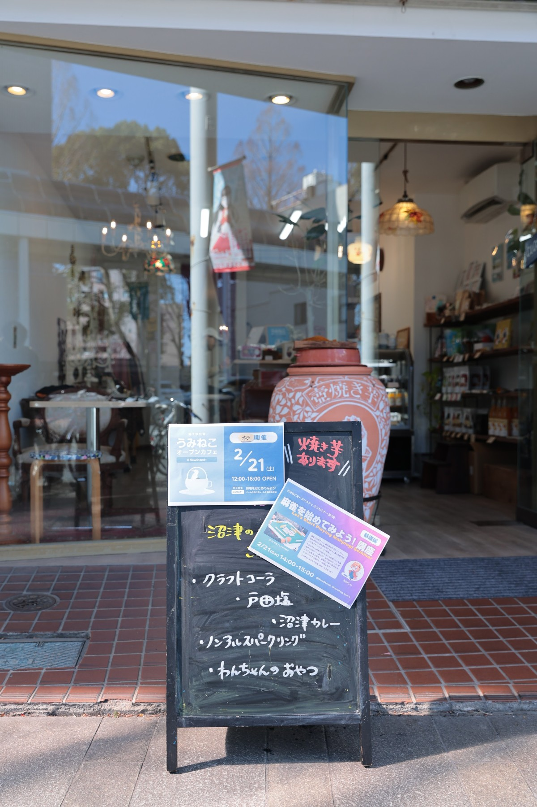
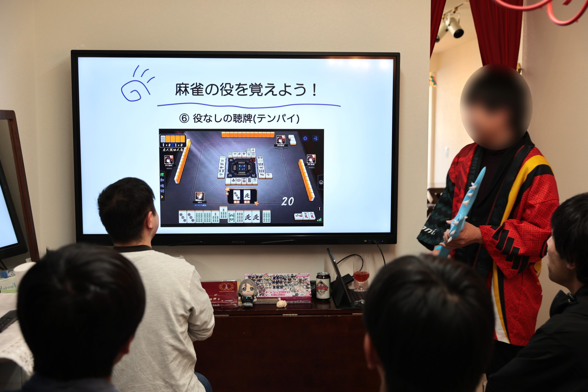

2026年2月21日(土)、沼津経済新聞編集部 NewStand+ さんをお借りして、「うみねこオープンカフェ」の第9回を開催しました。

この取り組みは、移住者の居場所づくりや、地域の人との交流を行うことを目的として、既設のカフェを貸し切って営業を行うという、[沼津市からの助成（マチカツ）を受けて行っている取り組み](/news/20250530/umineco_open_cafe.html)です。

今回は、毎回恒例となっているミニセミナーで「麻雀を始めてみよう！講座」を開催し、ルールや遊び方をゆるく解説してもらいました。ミニセミナー後は、「すずめ雀」や「ドンジャラNEO」で遊ぶ様子も見え、参加者同士の交流が深まる楽しい時間となりました。

うみねこオープンカフェは今後も、月1回開催する予定です。日程は決まり次第順次、うみねこの Discord の他、SNS やウェブサイトにてお知らせさせていただきます。
