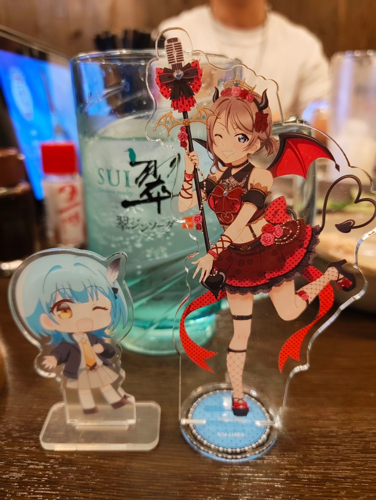
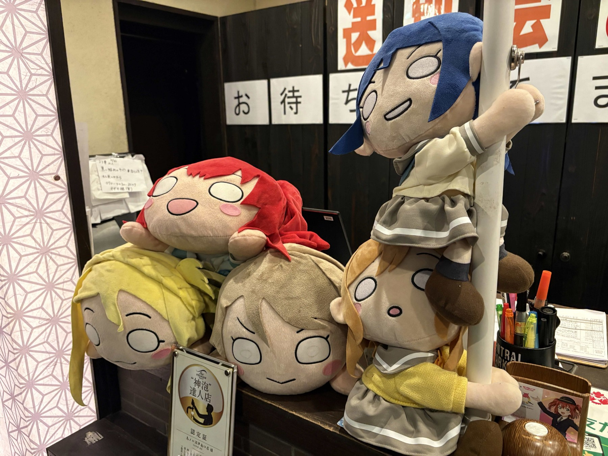

2026年3月28日(土)、うみねこリアル交流イベント「うみねこ会」の第26回を開催しました。

「うみねこ会」は、うみねこのメンバー同士の交流や情報交換を目的として、月に1回程度実施しているリアルイベントです。

今回の会場は「三代目 鳥メロ 沼津南口店」で、3月に沼津に移住したばかりの方も含め、約20名の方にご参加いただきました。

参加者同士、楽しく食事をしながら情報を交換し、新たな繋がりを作ることができました。
