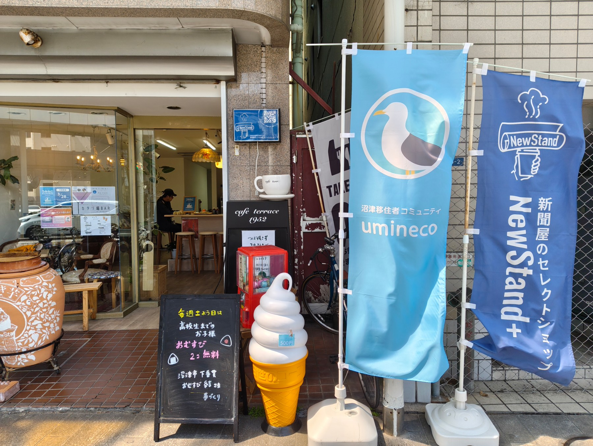
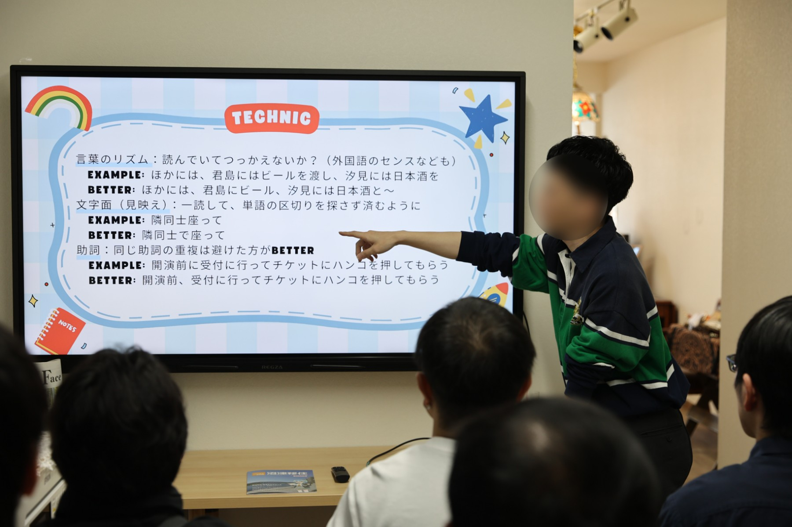

2026年3月28日(土)、沼津経済新聞編集部 NewStand+ さんをお借りして、「うみねこオープンカフェ」の第10回を開催しました。

この取り組みは、移住者の居場所づくりや、地域の人との交流を行うことを目的として、既設のカフェを貸し切って営業を行うという、[沼津市からの助成（マチカツ）を受けて行っている取り組み](/news/20250530/umineco_open_cafe.html)です。

初の試みとして、ミニセミナーでは外部講師のいちじょーさんをお招きし、「『ライブレポ』ってどう書くの？」というタイトルで、プロのライターとしての経験をベースにレポート記述のコツなどを解説していただきました。 参加者の皆さんからは、ときおり笑いの声が上がったり、内容についての質問な質問が交わされるなど、大変充実した時間となりました。
わざわざ沼津までお越しいただき、ご登壇いただいた講師のいちじょーさんに、改めて感謝申し上げます。

なお、昨年6月から計10回に渡り実施してきたマチカツ事業としてのオープンカフェ開催は今回が一旦の最終回となります。これまで開催にご協力いただいた皆様、会場にお越しいただいた皆様、本当にありがとうございました。

今後のうみねこオープンカフェは、2026年5月以降、不定期に開催予定です。詳細については、うみねこの Discord の他、SNS やウェブサイトにてお知らせさせていただきます。
