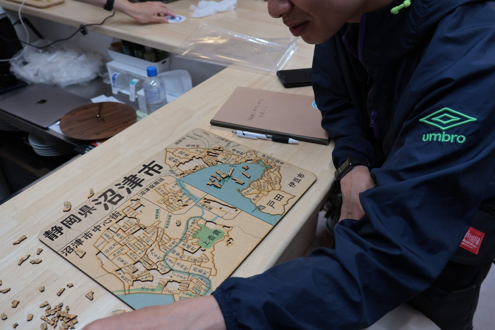
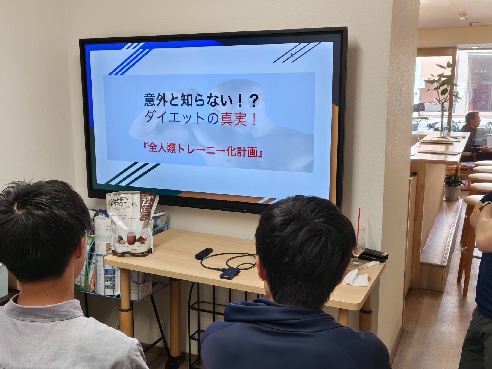
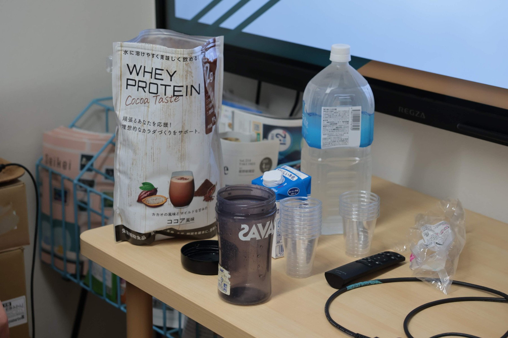

2026年5月16日(土)、沼津経済新聞編集部 NewStand+ さんをお借りして、「うみねこオープンカフェ」の第11回を開催しました。

うみねこオープンカフェは、移住者の居場所づくりや、地域の人との交流を行うことを目的として、既設のカフェを貸し切って営業を行うという取り組みです。
2026年3月までは「マチカツ」の事業として沼津市の助成をいただきながら定期的に実施していましたが、今回からは、うみねこが不定期に実施する独自のコミュニティ活動として位置づけています。

ミニセミナーでは、「筋トレ＆ダイエット講座２」というテーマで、健康的で長続きするダイエット方法が紹介されたほか、おすすめのプロテインを試し飲みするなどの体験もあり、非常に盛況でした。

うみねこオープンカフェは今後も、不定期で開催する予定です。日程は決まり次第順次、うみねこの Discord の他、SNS やウェブサイトにてお知らせさせていただきます。
