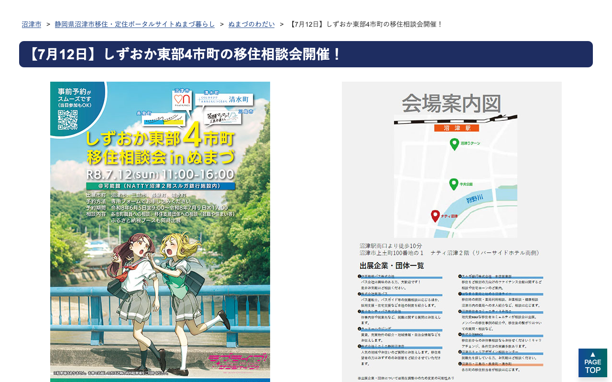
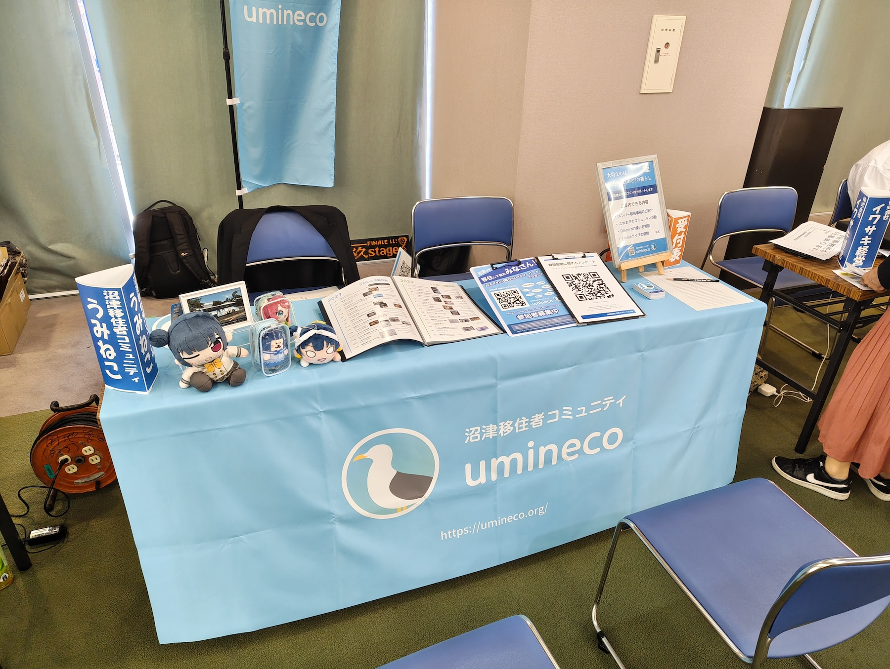

2026年7月12日(日)に、沼津市の主催で、移住を検討している方や、既に移住した方を対象に「しずおか東部4市町移住相談会 in ぬまづ」が行われ、その会場にぬまづ暮らしオススメ隊としてうみねこがブースを出展します。沼津市・三島市・長泉町・清水町の各市町職員による移住相談ブースのほか、バス会社による就職・住まい等の相談ブース、ふるさと納税PRブースなども出展予定です。

うみねこのブースでは、移住したメンバーの移住事例の紹介や、うみねこのこれまでの活動内容や参加方法のご案内など、移住前の方だけでなく移住後の方など、どなたでも訪問いただけるブースとする予定ですので、お気軽にお越しください。

### イベント概要

<table class="table">
<tr><th>日時</th><td>2026年7月12日(日)</td></tr>
<tr><th>場所</th><td>可能館（NATTY沼津2階 リバーサイドホテル南側） <small>〒410-0802 静岡県沼津市上土町100-1</small></td></tr>
<tr><th>ブース展示時間</th><td>11:00〜16:00（予定） <small>※都合によってスタッフが離席している場合もあります</small></td></tr>
<tr><th>参加費</th><td>無料</td></tr>
</table>

本イベントに関するの詳細や他ブースの出展内容、各市町職員への相談の予約については、沼津市移住定住ポータルサイトの特設ページをご確認ください。

- [【7月12日】しずおか東部4市町の移住相談会開催！ - 静岡県沼津市移住・定住ポータルサイトぬまづ暮らし／沼津市](https://www.city.numazu.shizuoka.jp/shisei/iju/topics/r08/20260712.htm)

<blockquote>

  

  <cite class="cite">静岡県沼津市移住・定住ポータルサイトぬまづ暮らし</cite>

</blockqoute>

- 昨年の出展の様子: [「ぬまづ暮らし何でも相談会」にブース出展しました](https://umineco.org/news/2025/0713/nandemo_soudankai)

