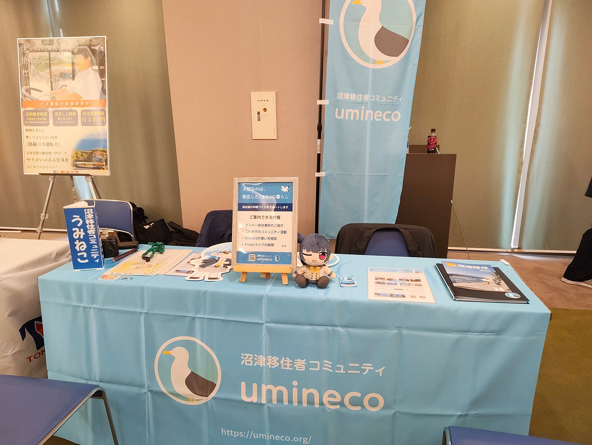

2026年7月12日、沼津市の主催で、移住を検討している方などを対象に「[しずおか東部4市町 移住相談会 in ぬまづ](https://www.city.numazu.shizuoka.jp/shisei/iju/topics/r08/20260712.htm)」が開催され、その会場にうみねこがブース出展を行いました。

沼津市・三島市・長泉町・清水町の各市町職員による移住相談ブースをメインに、バス会社による就職・住まい等の相談ブースやふるさと納税PRブースなども出展される中、[昨年のぬまづ暮らし何でも相談会](../../2025/0713/nandemo_soudankai.html)での出展に続き、2回目のブース出展となりました。

弊団体のブースでは、団体概要の説明とこれまでの活動の紹介や、メンバーの移住事例に基づいた相談などを行い、多くの方に来場していただきました。

今後も市などと連携し、移住相談のイベントなどで出展してまいりますので、ぜひお越しください。

また、うみねこでは Discord にて常時オンラインにて移住に関する相談を受け付けております。移住前の方のご参加も歓迎いたしますので、ぜひご利用ください。
