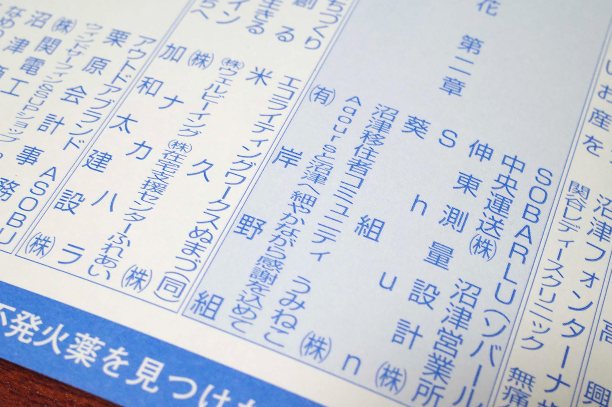

7月25・26日に開催される、[第79回 沼津夏まつり・狩野川花火大会](https://numazukanko.jp/news/1117) の花火プログラムに、[昨年に引き続いて](../../2025/0719/numazu_kanogawa_fireworks.html)今年もうみねこから協賛させていただきます。

実に70年以上の歴史を誇る狩野川花火大会は、沼津にはなくてはならない夏の風物詩であり、地域の方々から大事にされている祭事のひとつです。今年も我々の活動によって地域を盛り上げるための貢献ができることを嬉しく思っています。

なお、うみねこからの協賛による花火の打ち上げは7月26日(日)の予定です。

今回の協賛も、うみねこのメンバー内から協力していただける有志から募って実現いたしました。ご協力いただいた皆様、ありがとうございます。

### うみねこからの協賛者一覧 (50音順)

* あーさー
* アシオ
* 丑
* おざ沼
* おすず
* おま
* からうま
* シーナ
* じゅりあん
* tondol
* にし
* ぬまみかん
* ぴこまる
* ぷらむ
* まいまい
* みうら
* みつひこ
* めろん
* もみじぃ
* もろへいや
